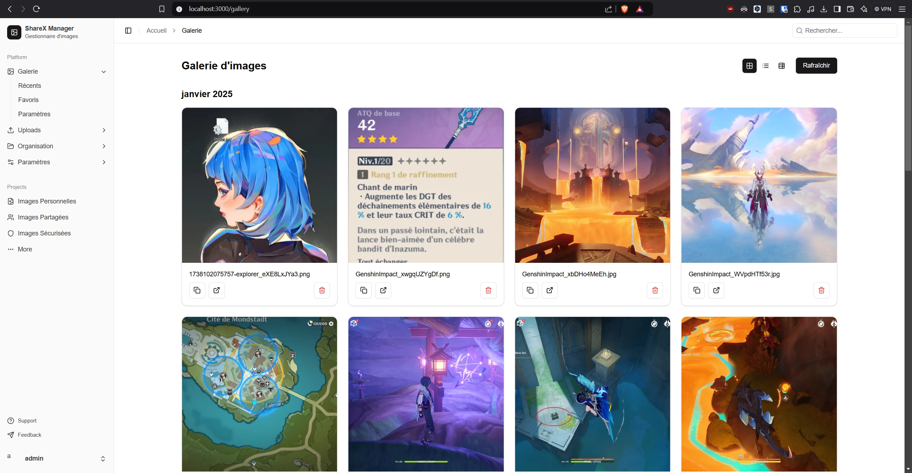
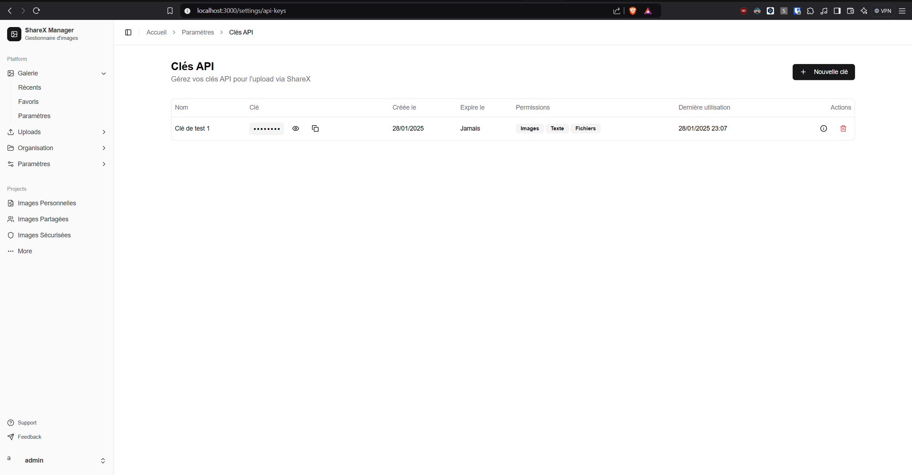

# ShareX Manager

Une application web pour gérer facilement vos uploads ShareX avec une interface moderne et sécurisée.

## Screenshot




## Fonctionnalités

- 🖼️ **Galerie d'images** - Visualisez et gérez tous vos fichiers uploadés
- 🔑 **Gestion des clés API** - Créez et gérez des clés API avec permissions personnalisées
- 🔒 **Sécurité** - Authentification des utilisateurs et gestion des permissions
- 📤 **Intégration ShareX** - Configuration automatique pour ShareX
- 🎨 **Interface moderne** - Design responsive avec thème clair/sombre
- 📱 **Multi-appareils** - Fonctionne sur desktop, tablette et mobile

## Installation

1. Clonez le dépôt :
```bash
git clone https://github.com/votre-username/sharex-manager.git
cd sharex-manager
```

2. Installez les dépendances :
```bash
bun install
```

3. Créez un fichier `.env.local` avec les variables d'environnement :
```bash
AUTH_SECRET=votre_secret_auth
NEXT_PUBLIC_API_URL=http://localhost:3000
```

4. Lancez le serveur de développement :
```bash
bun dev
```

5. Ouvrez [http://localhost:3000](http://localhost:3000) dans votre navigateur

## Configuration de ShareX

1. Créez une clé API dans l'interface d'administration
2. Utilisez la configuration générée automatiquement pour ShareX
3. Importez le fichier `.sxcu` dans ShareX
4. Commencez à uploader !

## Technologies utilisées

- [Next.js 14](https://nextjs.org/) - Framework React
- [NextAuth.js](https://next-auth.js.org/) - Authentification
- [Tailwind CSS](https://tailwindcss.com/) - Styles
- [shadcn/ui](https://ui.shadcn.com/) - Composants UI
- [Lucide Icons](https://lucide.dev/) - Icônes

## Structure du projet

```
sharex-manager/
├── app/                # Routes et pages Next.js
├── components/         # Composants React réutilisables
├── public/            # Fichiers statiques et uploads
├── styles/           # Styles globaux
└── types/            # Types TypeScript
```

## Licence

Ce projet est sous licence MIT. Voir le fichier `LICENSE` pour plus de détails.