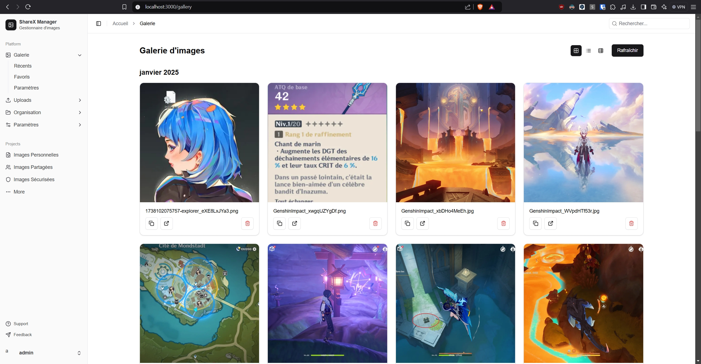
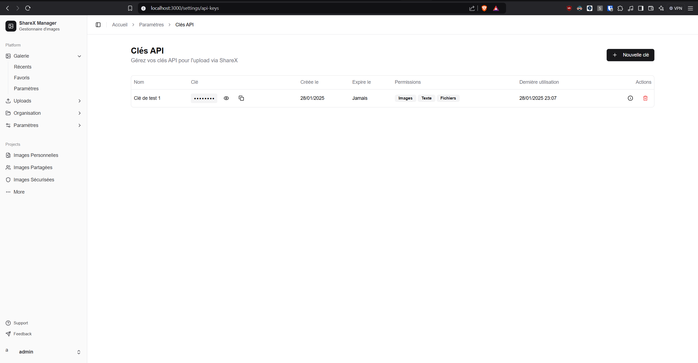

# ShareX Manager

Une application web pour gérer facilement vos uploads ShareX avec une interface moderne et sécurisée.

📖 **[Site & documentation](https://pedrokarim.github.io/sharex-manager/)** · 📚 **[Wiki](https://github.com/pedrokarim/sharex-manager/wiki)** · 🚀 **[Démo](https://sxm.ascencia.re)**

## Screenshot




## Fonctionnalités

- 🖼️ **Galerie d'images** - Visualisez et gérez tous vos fichiers uploadés
- 📊 **Statistiques** - Suivez vos uploads avec des statistiques détaillées
- 🗂️ **Gestion des fichiers** - Organisez et gérez vos fichiers avec une interface intuitive
- 🔑 **Gestion des clés API** - Créez et gérez des clés API avec permissions personnalisées
- 🔒 **Sécurité** - Authentification des utilisateurs et gestion des permissions
- 📤 **Intégration ShareX** - Configuration automatique pour ShareX
- 🎨 **Interface moderne** - Design responsive avec thème clair/sombre
- 📱 **Multi-appareils** - Fonctionne sur desktop, tablette et mobile
- 🖼️ **Génération de miniatures** - Création automatique de thumbnails pour vos images
- 📂 **Historique des uploads** - Consultez l'historique complet de vos uploads

## Installation

1. Clonez le dépôt :
```bash
git clone https://github.com/AliasPedroKarim/sharex-manager.git
cd sharex-manager
```

2. Installez les dépendances :
```bash
bun install
```

3. Créez un fichier `.env.local` avec les variables d'environnement :
```bash
# Auth
AUTH_SECRET=votre_secret_auth
NEXTAUTH_URL=http://localhost:3000

# Application
NEXT_PUBLIC_API_URL=http://localhost:3000

```

4. Lancez le serveur de développement :
```bash
bun dev
```

5. Ouvrez [http://localhost:3000](http://localhost:3000) dans votre navigateur

## Configuration de ShareX

1. Créez une clé API dans l'interface d'administration
2. Utilisez la configuration générée automatiquement pour ShareX
3. Importez le fichier `.sxcu` dans ShareX
4. Commencez à uploader !

## Utilisation bureau (Windows & Linux)

ShareX Manager fonctionne avec n'importe quel client compatible `.sxcu` :

- 🪟 **Windows** → [ShareX](https://getsharex.com)
- 🐧 **Linux** → [`fu` (flameshot-uploader)](https://github.com/pedrokarim/flameshot-uploader), qui lit **le même `.sxcu`**.

Dans les deux cas, on récupère la config de la même façon : **Paramètres → Clés API → créer une clé → onglet « Configuration ShareX » → Copier**.

### Windows (ShareX)

1. Collez la config dans un fichier `sharex-manager.sxcu`.
2. **Double-cliquez** le fichier → ShareX l'importe.
3. Capturez (par défaut **Impr. écran**) → l'URL est copiée.

### Linux (Flameshot + `fu`)

```sh
# 1. Installer fu
curl -fsSL https://pedrokarim.github.io/flameshot-uploader/install.sh | sh

# 2. Dépendances (jq est requis pour lire l'URL de réponse)
sudo apt install flameshot xclip jq

# 3. Enregistrer la config copiée dans un fichier, puis :
fu add ~/sharex-manager.sxcu
fu default sharex-manager
```

4. Associez un raccourci clavier à la commande **`fu gui`** (ex. la touche **Impr. écran**).
5. Capturez → l'URL est copiée.

> 📖 **Guides complets, pas-à-pas (avec captures)** : [Windows](docs/integration-windows.md) · [Linux](docs/integration-linux.md) – également disponibles sur le [wiki](https://github.com/pedrokarim/sharex-manager/wiki).

## Technologies utilisées

- [Next.js 14](https://nextjs.org/) - Framework React avec App Router
- [NextAuth.js v5](https://next-auth.js.org/) - Authentification
- [Tailwind CSS](https://tailwindcss.com/) - Styles
- [shadcn/ui](https://ui.shadcn.com/) - Composants UI
- [Lucide Icons](https://lucide.dev/) - Icônes
- [Bun](https://bun.sh/) - Runtime JavaScript
- [Sharp](https://sharp.pixelplumbing.com/) - Traitement d'images

## Versions et releases

Le serveur et l'application mobile possèdent des versions indépendantes :

- serveur : tags `server-vX.Y.Z` ;
- mobile : tags `mobile-vX.Y.Z`.

Les versions suivent SemVer et chaque composant possède son propre changelog.
Consultez la [politique de versioning](docs/versioning.md), le
[changelog serveur](CHANGELOG.md) et le
[changelog mobile](sharex-mobile/CHANGELOG.md) avant de préparer une release.

## Structure du projet

```
sharex-manager/
├── app/                    # Routes et pages Next.js
│   ├── (app)/             # Routes protégées
│   ├── api/               # Routes API
│   └── auth/              # Routes d'authentification
├── components/            # Composants React réutilisables
│   ├── ui/               # Composants shadcn/ui
│   └── gallery/          # Composants de la galerie
├── hooks/                # Hooks React personnalisés
├── lib/                  # Utilitaires et configurations
├── public/              # Fichiers statiques
│   ├── uploads/         # Fichiers uploadés
│   └── uploads/thumbnails/  # Miniatures générées
├── styles/             # Styles globaux
└── types/              # Types TypeScript
```

## Licence

Ce projet est sous licence GNU General Public License v3.0. Voir le fichier `LICENSE` pour plus de détails.
