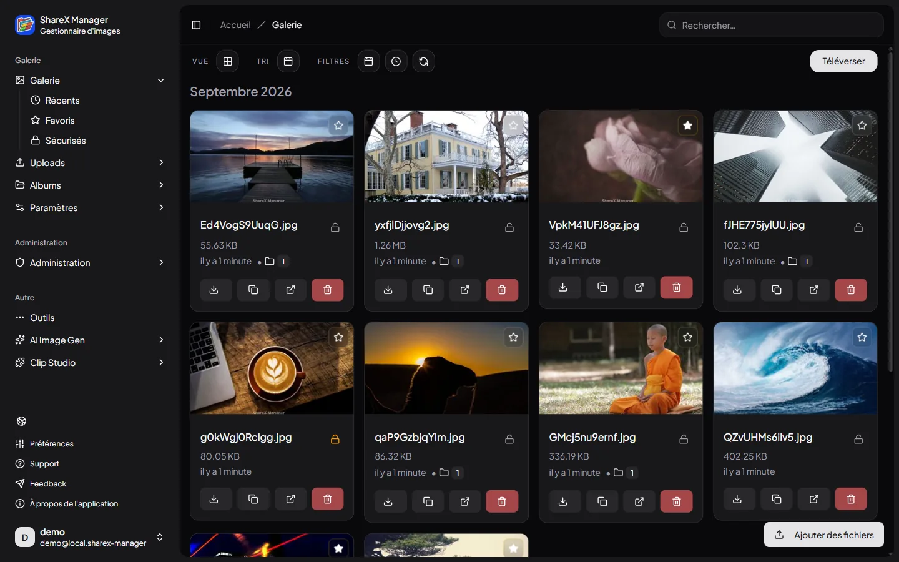
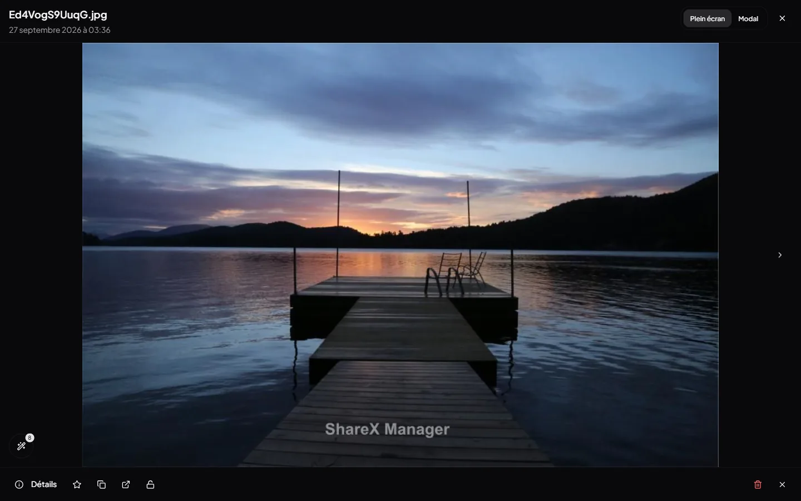
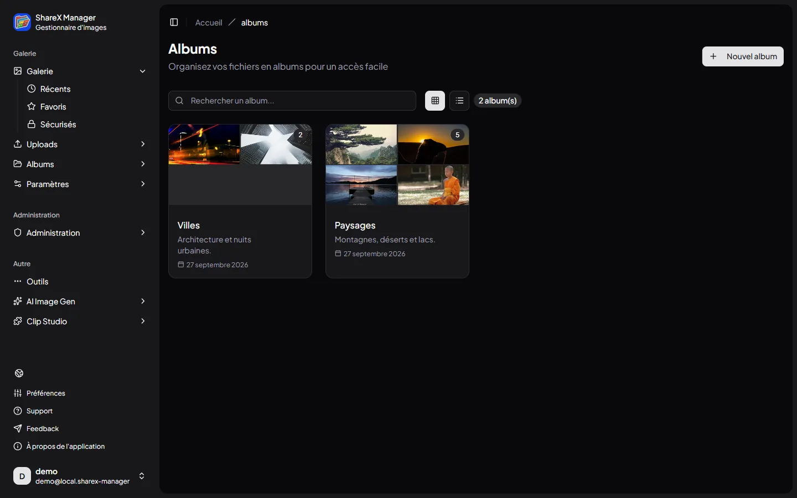
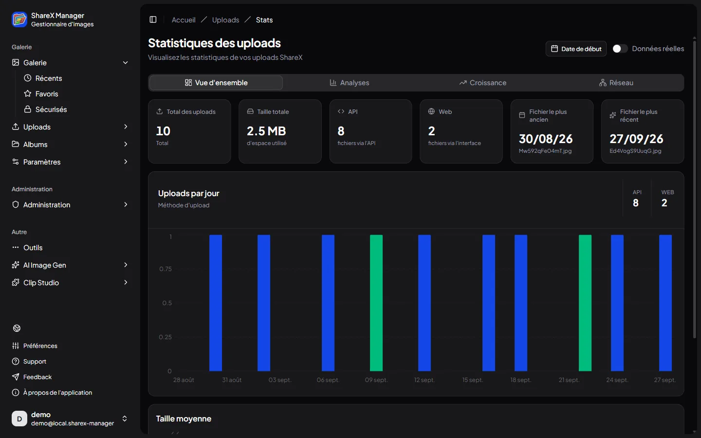
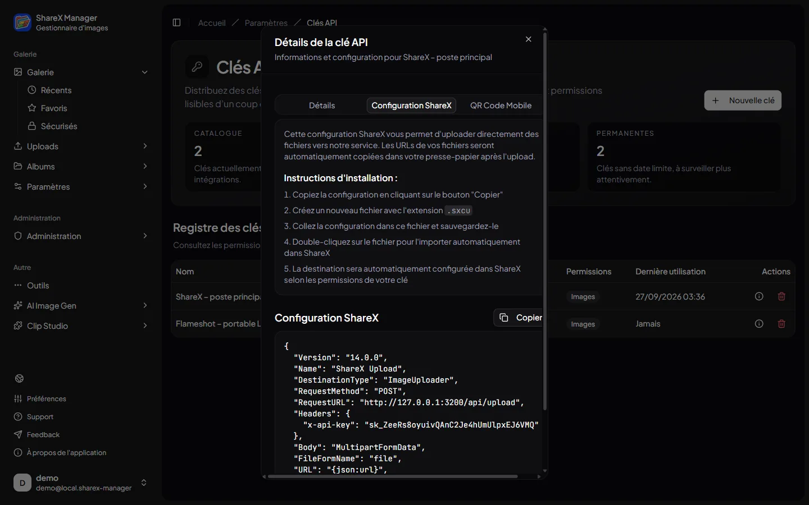
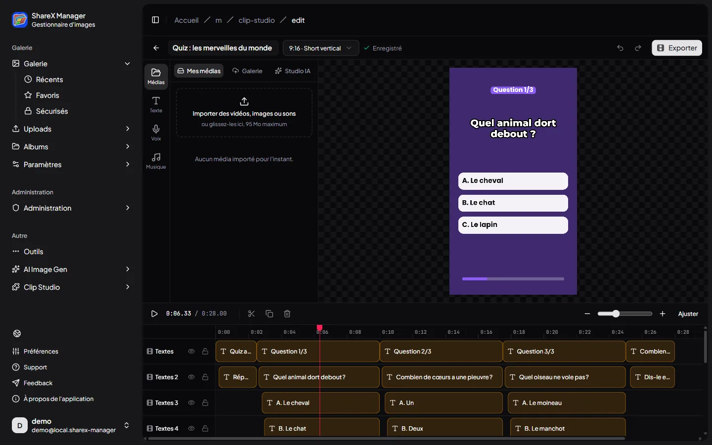
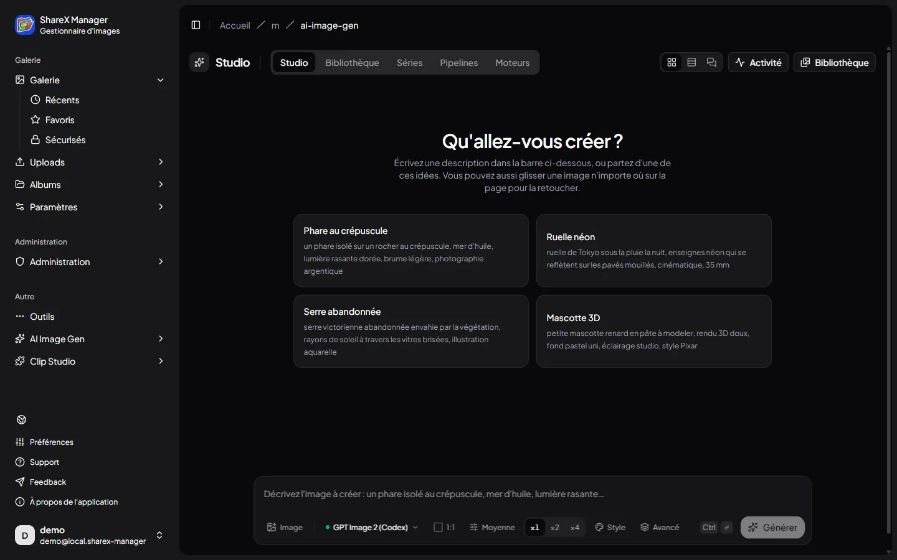
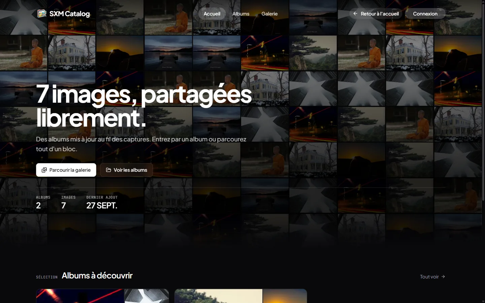
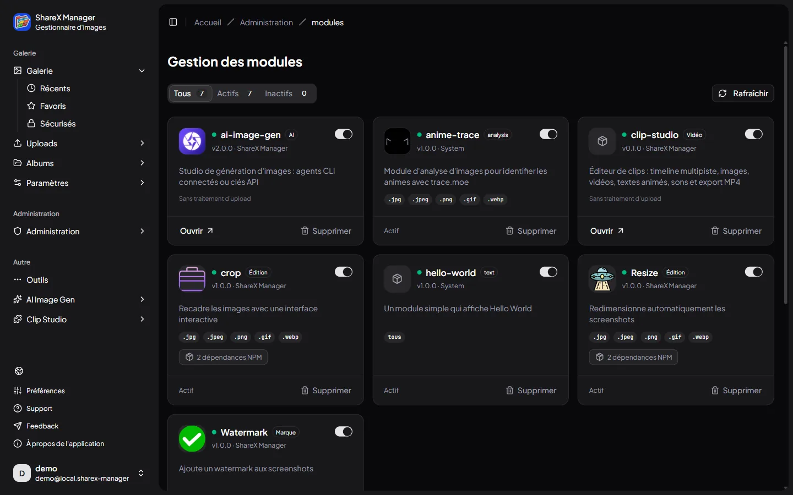

# ShareX Manager

Le point de chute de vos captures d’écran, sur votre propre serveur. ShareX,
Flameshot ou l’application Android envoient, ShareX Manager range, génère les
miniatures et renvoie un lien public prêt à partager.

📖 **[Site et documentation](https://pedrokarim.github.io/sharex-manager/)** · 📚 **[Wiki](https://github.com/pedrokarim/sharex-manager/wiki)** · 🚀 **[Démo](https://sxm.ascencia.re)**



## Fonctionnalités

- **Galerie** en mosaïque ou en liste, regroupée par mois, avec recherche,
  filtres, favoris et visionneuse plein écran.
- **Liens publics par défaut** : chaque capture envoyée est immédiatement
  partageable. Une capture peut être rendue privée depuis l’interface ; elle
  n’est alors visible que connecté.
- **Albums** et **catalogue public** : publier une sélection sur une page
  soignée, sans rien exposer d’autre.
- **Clés API** avec permissions par type de fichier, et configuration `.sxcu`
  générée pour ShareX (et Flameshot via `fu`).
- **Historique et statistiques** des envois, par jour, par méthode et par clé.
- **Modules** qui s’activent à la demande :
  - traitements automatiques à l’envoi : filigrane, redimensionnement,
    recadrage ;
  - **AI Image Gen**, un studio de génération d’images (agents CLI connectés
    comme Codex, ou clés API) ;
  - **Clip Studio**, un éditeur de clips vidéo avec timeline, modèles (quiz,
    top, diaporama), assistant IA, voix de synthèse locales, banque de
    musique libre de droits et sous-titres animés, export MP4 dans le
    navigateur.
- **Application Android** (`sharex-mobile/`) pour envoyer depuis le partage
  du téléphone.
- **Authentification** intégrée (comptes créés par l’administrateur) ou via
  [Ascencia ID](docs/authentication.md) en OIDC.
- Interface en français, thèmes clair et sombre, adaptée au mobile.

| Visionneuse | Albums |
| --- | --- |
|  |  |
| **Statistiques** | **Clés API et configuration ShareX** |
|  |  |
| **Clip Studio** | **AI Image Gen** |
|  |  |
| **Catalogue public** | **Modules** |
|  |  |

D’autres captures (thème clair, mobile, historique, configuration) sont dans
[`docs/images/`](docs/images/).

## Installation

Prérequis : [Bun](https://bun.sh/) 1.3 ou plus récent.

```bash
git clone https://github.com/pedrokarim/sharex-manager.git
cd sharex-manager
bun install
bun run setup
bun dev
```

L’assistant `bun run setup` demande l’URL publique, le port et le mode
d’authentification, génère les secrets et crée le premier administrateur.
L’inscription libre est fermée : les comptes suivants se créent depuis
l’administration. Le mode automatisé et Ascencia ID sont décrits dans
[le guide d’authentification](docs/authentication.md).

Ouvrez ensuite l’URL choisie (par défaut [http://localhost:3000](http://localhost:3000)).

### Avec Docker

```bash
bun run setup            # crée .env et config/uploads.json
docker compose up -d --build
```

Les données (`uploads/`, `data/`, `config/`, données des modules) restent
sur l’hôte, dans des volumes. Voir [la sécurité du déploiement](docs/security.md)
et [le redéploiement automatique](docs/deploiement-cron.md).

## Envoyer ses captures

Dans l’interface : **Paramètres → Clés API → Nouvelle clé**, puis l’onglet
« Configuration ShareX » de la clé, et **Copier**.

- 🪟 **Windows**, avec [ShareX](https://getsharex.com) : collez la
  configuration dans un fichier `sharex-manager.sxcu`, double-cliquez-le,
  capturez. [Guide pas à pas](docs/integration-windows.md).
- 🐧 **Linux**, avec Flameshot et
  [`fu` (flameshot-uploader)](https://github.com/pedrokarim/flameshot-uploader),
  qui lit le même `.sxcu`. [Guide pas à pas](docs/integration-linux.md).
- 📱 **Android** : l’application de `sharex-mobile/` se configure en
  scannant le QR code de la clé.

## Technologies

- [Next.js 16](https://nextjs.org/) (App Router, Turbopack) et React 19
- [Bun](https://bun.sh/) pour l’exécution, les scripts et le CLI
- [better-auth](https://www.better-auth.com/) pour l’authentification,
  [Ascencia ID](docs/authentication.md) en option
- [Tailwind CSS 4](https://tailwindcss.com/), [shadcn/ui](https://ui.shadcn.com/),
  [Framer Motion](https://motion.dev/), icônes [Lucide](https://lucide.dev/)
- [Sharp](https://sharp.pixelplumbing.com/) pour les miniatures et les
  traitements d’images
- [Mediabunny](https://mediabunny.dev/) et [Piper](https://github.com/rhasspy/piper)
  pour l’export vidéo et les voix de Clip Studio
- [Expo](https://expo.dev/) pour l’application Android

## Structure du projet

```
sharex-manager/
├── src/
│   ├── app/            # Pages et routes API (App Router)
│   ├── components/     # Composants React (ui/ = shadcn/ui)
│   ├── lib/            # Logique serveur et utilitaires
│   ├── hooks/          # Hooks React
│   ├── proxy.ts        # Proxy Next.js (en-têtes, routes publiques)
│   └── instrumentation.ts
├── modules/            # Modules (AI Image Gen, Clip Studio, traitements…)
├── cli/                # CLI : bun run setup, journaux, déploiement
├── scripts/            # Scripts de maintenance et de release
├── tests/              # Tests Vitest
├── public/             # Fichiers statiques
├── config/             # Réglages d’exécution (uploads.json)
├── docs/               # Documentation et captures
├── website/            # Site GitHub Pages
└── sharex-mobile/      # Application Android (Expo)
```

## Développement

```bash
bun dev                  # serveur de développement
bun run test             # tests (Vitest)
bun run build            # build de production
```

Avant de contribuer, lisez [`AGENTS.md`](AGENTS.md) et le guide du composant
concerné dans [`.agents/`](.agents/README.md).

## Versions et releases

Le serveur et l’application mobile ont des versions indépendantes (tags
`server-vX.Y.Z` et `mobile-vX.Y.Z`, SemVer) et chacun son changelog. Voir la
[politique de versioning](docs/versioning.md), le
[changelog serveur](CHANGELOG.md) et le
[changelog mobile](sharex-mobile/CHANGELOG.md).

## Licence

GNU General Public License v3.0. Voir [`LICENSE`](LICENSE).

Les photos des captures d’écran de ce dépôt sont sous licence CC0 (domaine
public), issues d’[Openverse](https://openverse.org/).
