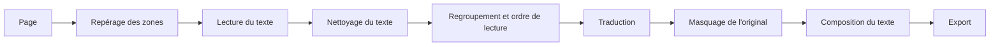

# 06 – Scan Studio

Traduire les pages d’un scan de manga : repérer les zones de texte, lire ce
qu’elles contiennent, traduire, masquer l’original et reposer la traduction à
sa place, dans un atelier où tout reste retouchable à la main.

- **Identifiant** : `scan-studio`
- **Libellé** : « Scan Studio »
- **Prérequis** : aucun module. S’appuie, s’ils sont activés, sur les moteurs
  d’AI Image Gen et sur Codex CLI (voir § 7.4).
- **État** : réalisés, l’atelier manuel (S1), l’analyse automatique de
  l’anglais (S2, après le banc d’essai S0 :
  [résultats](06-scan-studio-banc-essai.md), dont un essai sur de vraies
  pages), la traduction par DeepL et LibreTranslate (S3), l’import d’un
  chapitre par son lien (§ 19) et les pages à laisser telles quelles. Restent
  le japonais, le chinois et le coréen (S4), l’IA en dernier recours (S5), les
  finitions (S6) et la lecture publique (S7).
  Réalisés depuis : la lecture publique (S7, § 11.2) et, pour les finitions
  (S6), le lot sur un dossier, l’export `.cbz` et l’envoi dans la galerie.
  Réalisés aussi : la page « Polices » et la table des styles par dossier
  (§ 8), l’IA en dernier recours (S5, § 7.6) et, pour les finitions (S6), le
  fond reconstruit sans IA (§ 6.6) et les onomatopées (§ 6.7).
  Réalisés enfin : le japonais, le chinois et le coréen (S4) : lecture en
  lignes et en colonnes, furigana écartés, ordre de lecture par format et
  bandes de webtoon par tranches
  ([mesures](06-scan-studio-banc-essai.md), § 8).

> Ce dossier part de la demande dictée par Karim le 06/10/2026. Le § 2 la
> reprend point par point ; le § 17 liste ce qu’elle ne disait pas et que le
> dossier a dû trancher ou laisser ouvert.

## 0. Décisions prises

Réponses de Karim du 06/10/2026 aux questions du dossier.

- **Nom** : « Scan Studio », identifiant `scan-studio`. Son logo suit la
  famille des logos de modules (autocollant illustré, rangé dans
  `branding/`).
- **Traduction : les deux moteurs, pas l’un ou l’autre.** DeepL et
  LibreTranslate travaillent ensemble, l’un relayant l’autre quand il tombe,
  avec une règle absolue : **ne jamais marteler une API**. Le § 7.5 décrit le
  routage.
- **Les modules se parlent.** Scan Studio appelle directement la génération
  d’images d’AI Image Gen quand il en a besoin, comme Clip Studio le fait pour
  ses illustrations. La section de catalogue (`catalogSections`) se conçoit
  une fois dans le socle, pour tous les modules.

## 1. Pourquoi ce module

Un « scan » est la version numérique d’un chapitre de manga : une suite
d’images, une par page. Le traduire à la main, c’est quatre métiers qui se
suivent, ceux des équipes de scantrad : relever le texte, le traduire,
nettoyer la page (effacer le texte d’origine), puis lettrer (reposer la
traduction dans les bulles). Chacun se fait aujourd’hui dans un outil
différent.

Le module réunit ces quatre gestes au même endroit, et automatise ceux qui
peuvent l’être sans retirer la main à personne : la machine propose, l’atelier
laisse tout corriger.

## 2. La demande, remise en contexte

| Ce que Karim a demandé | Ce que le dossier en fait |
| --- | --- |
| Détecter automatiquement le texte d’une page de scan | Chaîne de détection puis de lecture, § 6.1 et § 6.2 |
| Traduire et reposer la traduction dans la langue voulue | Traduction § 6.5, composition § 6.7 |
| **Le moins d’IA possible**, l’IA en dernier recours | Échelle de recours à quatre niveaux, § 3 : rien ne passe au niveau suivant sans un geste ou un réglage explicite |
| Pouvoir quand même choisir une IA dans la palette existante | Les moteurs d’AI Image Gen et Codex CLI, tels que les autres modules les utilisent, § 7.4 |
| Créer des dossiers, créer des chapitres ; un chapitre contient les images de ses pages | Bibliothèque à trois étages : dossier, chapitre, page, § 5.1 et § 9 |
| Nettoyer correctement le texte récupéré (« sanitize ») | Normalisation du texte lu et précautions à l’envoi, § 6.3 et § 13 |
| Surtout de l’anglais en entrée, mais prévoir japonais, chinois, coréen | Langue source par chapitre, moteurs de lecture par langue, § 7.2 |
| Format manga, mais aussi manhua et webtoon | Sens de lecture et pages en bande, § 6.4 |
| Modifier les traductions, re-sélectionner une zone de texte | Atelier : chaque zone est un objet éditable, § 5.2 |
| Déplacer le texte traduit pour qu’il tombe juste | Le texte est un bloc libre, distinct de la zone lue, § 5.2 |
| Masquer l’endroit d’origine avec un fond blanc ou d’une autre couleur, réglable | Masque par zone : forme, couleur, § 6.6 |
| Retrouver la police, ou au moins celle que les traducteurs utilisent | Polices de lettrage et styles par type de texte, § 8 |
| Pouvoir changer la police ; un vrai studio de retouche, comme dans Clip Studio | Atelier à calques, inspecteur, historique, § 5 |
| Demander à une IA de traduire toute la page sans toucher au reste | « Traduction de la page entière par IA », dernier niveau de l’échelle, § 6.8 |
| Coller le lien d’un chapitre et laisser le module en récupérer les pages, site par site | Adaptateurs de sources et import par lien, § 19 |
| Plus tard : une section dans le catalogue public, si le module est activé, pour faire lire un chapitre à des amis | Lecture publique, § 11.2, étape S7 |

## 3. Le principe : une échelle de recours

« IA » recouvre des choses très différentes. Le dossier distingue quatre
niveaux, et le module commence toujours par le plus bas.

| Niveau | Ce qui travaille | Où ça tourne | Coût |
| --- | --- | --- | --- |
| 0 – À la main | L’utilisateur trace les zones, tape ou colle le texte et la traduction | Navigateur | Aucun |
| 1 – Moteurs locaux | Petits modèles spécialisés : repérage des zones de texte, lecture des caractères. Ils ne « comprennent » rien et ne génèrent rien : ils localisent et transcrivent | Navigateur de préférence, serveur sinon | Aucun |
| 2 – Traduction automatique | Un service de traduction classique (DeepL, Google Traduction, ou LibreTranslate auto-hébergé) : il reçoit du texte, rend du texte | Service externe ou serveur | Selon le service |
| 3 – IA générative | Un modèle de langage ou d’image : relire une zone illisible, traduire avec le contexte du chapitre, ou retoucher la page entière | Codex CLI, moteurs d’AI Image Gen | Abonnement ou clé |

Règles :

- **Le niveau 3 n’est jamais déclenché tout seul.** Il se lance d’un bouton,
  sur une zone, une page ou un chapitre, et l’interface dit quel moteur va
  travailler avant de le lancer.
- Un chapitre porte un réglage « niveau maximal autorisé » (2 par défaut).
  À 0, le module est un simple atelier de lettrage ; à 1, rien ne sort de la
  machine.
- Chaque zone garde la trace de ce qui l’a produite (lecture locale,
  traduction DeepL, relecture par tel modèle) : on sait toujours d’où vient un
  texte.

Honnêteté sur le niveau 1 : repérer du texte dans un dessin ne se fait pas
correctement sans un modèle entraîné. Les méthodes purement géométriques
(contours, composantes connexes) trouvent les bulles blanches bien nettes et
ratent le reste. Le niveau 1 utilise donc de l’apprentissage automatique, mais
local, déterministe, sans rien envoyer nulle part et sans rien générer.

## 4. Parcours

1. Dans « Scan Studio », l’utilisateur crée un **dossier** (une série), puis
   un **chapitre**, et y dépose ses pages : glisser-déposer d’images, archive
   `.zip` ou `.cbz`, sélection dans la galerie, ou lien du chapitre sur un
   site de lecture géré (§ 19). Les pages se rangent dans l’ordre naturel de
   leurs noms (`2.png` avant `10.png`) et se réordonnent à la main.
2. Il choisit la langue source, la langue cible et le format (manga, manhua,
   webtoon). Les valeurs du dossier servent de défaut.
3. « Analyser » repère les zones de texte et les lit, page par page, dans une
   file dont l’avancement est visible. Les pages déjà prêtes sont ouvrables
   sans attendre les autres.
4. « Traduire » remplit les traductions avec le moteur choisi. Les zones dont
   la lecture est douteuse sont signalées, pas traduites à l’aveugle.
5. Dans l’atelier, chaque zone montre son texte d’origine, sa traduction, son
   masque et son bloc de texte. Tout se corrige : retracer une zone, retaper
   une traduction, déplacer ou redimensionner le texte, changer de police.
6. « Exporter » produit les pages traduites : images une à une, archive du
   chapitre, ou envoi dans la galerie.

Le parcours fonctionne à tous les niveaux de l’échelle : au niveau 0, les
étapes 3 et 4 sont remplacées par le tracé et la saisie à la main.

## 5. Interface

### 5.1 Bibliothèque

Trois étages, chacun avec sa page :

- **Dossiers** : une grille de cartes, illustrées par la première page de leur
  dernier chapitre. Un dossier porte les réglages par défaut de ses chapitres
  (langues, format, police, moteurs) et son **glossaire** (§ 6.5).
- **Chapitres** d’un dossier : une liste ordonnée (numéro, titre, nombre de
  pages, avancement : pages analysées, traduites, relues, exportées).
- **Pages** d’un chapitre : une planche de vignettes réordonnables, avec
  l’état de chacune.

Menus contextuels à chaque étage (renommer, dupliquer, déplacer, exporter,
supprimer), identiques au bouton « … ».

### 5.2 Atelier d’une page

Un espace de travail plein écran, sur le modèle de l’éditeur de Clip Studio.

```
┌───────────────────────────────────────────────────────────────────┐
│ ← Chapitre 12   page 4 / 18   [Original | Traduit | Côte à côte]  │
│                                      [Analyser] [Traduire] [Exporter ▾]
├────────┬──────────────────────────────────────────┬───────────────┤
│ Pages  │                                          │ Zone          │
│ ▢ 1    │            ┌───────────────┐             │  Texte lu     │
│ ▢ 2    │            │    page       │             │  Traduction   │
│ ▣ 4    │            │  ┌─────┐      │             │ Masque        │
│ ▢ 5    │            │  │zone │      │             │  Forme, couleur
│        │            │  └─────┘      │             │ Texte         │
│        │            └───────────────┘             │  Police, taille
│        │                                          │  Contour, alignement
├────────┴──────────────────────────────────────────┴───────────────┤
│ Zones : 1 « … »   2 « … »   3 ⚠ lecture douteuse   4 « … »         │
└───────────────────────────────────────────────────────────────────┘
```

- **Scène centrale** : la page, zoomable (molette, pincement) et déplaçable.
  Trois vues : original, traduit, côte à côte.
- **Chaque zone est faite de trois objets distincts** :
  1. la **zone lue** : le contour du texte d’origine (rectangle ou polygone),
     qu’on peut retracer ; elle sert à la lecture ;
  2. le **masque** : ce qui recouvre l’original ; il part de la zone lue mais
     se règle à part ;
  3. le **bloc de texte** : la traduction, librement déplaçable, tournable et
     redimensionnable, avec ses poignées. Il part du centre de la zone lue.
- **Liste des zones** en bas, dans l’ordre de lecture : un clic sélectionne
  la zone sur la page, Tab passe à la suivante. On peut y traduire tout le
  chapitre au clavier sans toucher la souris.
- **Inspecteur** à droite, selon la sélection : texte lu (modifiable, avec
  « relire cette zone »), traduction (avec « retraduire » et l’historique des
  propositions), masque, style du texte.
- **Outils** : sélection, nouvelle zone (rectangle), nouvelle zone
  (polygone), pinceau de masque, pipette de couleur, main.
- **Historique** annuler / rétablir sur toute la page, comme dans Clip Studio.

### 5.3 Raccourcis

| Touche | Action |
| --- | --- |
| `V`, `R`, `P`, `B`, `I`, `H` | Sélection, rectangle, polygone, pinceau, pipette, main |
| `S` | Onomatopée : une zone posée sur le dessin, sans masque |
| `Tab` / `Maj+Tab` | Zone suivante / précédente dans l’ordre de lecture |
| `Entrée` | Éditer la traduction de la zone sélectionnée |
| `Ctrl+Z` / `Ctrl+Maj+Z` | Annuler / rétablir |
| `←` `→` (hors édition) | Page précédente / suivante |
| `O` | Basculer original / traduit |
| `Suppr` | Supprimer la zone |

### 5.4 Pages secondaires

- **Glossaire** du dossier : noms propres, termes, onomatopées, avec la
  traduction imposée.
- **Moteurs** : choix et état de chaque moteur de lecture, de traduction et
  d’IA, clés, test de connexion.
- **Sources** : les sites dont un lien de chapitre peut être importé, leur
  état, et un champ pour tester un lien (§ 19).
- **Polices** : polices fournies, polices ajoutées, styles par type de texte.

## 6. Chaîne de traitement



Chaque étape écrit son résultat dans la page (§ 9) et peut être relancée
seule, sur une zone, une page ou un chapitre. Une correction faite à la main
n’est jamais écrasée par une relance : elle est marquée comme telle.

### 6.1 Repérage des zones

- Sortie : pour chaque bloc de texte, un contour, un sens d’écriture
  (horizontal ou vertical) et un **type** : dialogue, pensée, récitatif,
  onomatopée, texte du décor.
- Un modèle de détection dédié à la bande dessinée (du type
  `comic-text-detector`) rend aussi un masque fin des caractères, utile au
  masquage.
- Les onomatopées et le texte du décor sont repérés mais **non traités par
  défaut** : les effacer abîme le dessin. On les traite à la demande.

**Réalisé (S2, S4).** Le repérage se fait sur les pixels, sans modèle :
les lettres sont de petites taches d’encre dans une plage unie fermée par un
trait, la bulle ou le cartouche. Pour le japonais, le chinois et le coréen,
trois choses s’ajoutent :

- les taches d’un même signe sont réunies avant tout : un kanji est fait de
  plusieurs traits séparés ;
- le **sens d’écriture** est relevé bulle par bulle, sur la disposition des
  signes : en colonnes quand ils se serrent de haut en bas, en lignes quand
  ils se serrent de gauche à droite. La langue ne tranche que lorsqu’il n’y a
  rien à mesurer (japonais : colonnes ; chinois, coréen : lignes) ;
- les colonnes d’une bulle font **une seule zone**, qui porte son sens
  (`direction`), et le texte anglais garde ses règles propres.

Le détecteur ONNX n’a pas été mesuré : il reste la piste pour le texte posé
sur le dessin.

### 6.2 Lecture du texte

Chaque zone est découpée, redressée, agrandie si elle est petite, puis lue par
le moteur de la langue source (§ 7.2). La lecture rend le texte et une
**confiance** ; sous un seuil, la zone est marquée « à vérifier ».

**Réalisé (S4).** Une zone en colonnes est lue par le modèle des colonnes
de sa langue, une zone en lignes par celui des lignes ; chaque modèle n’est
téléchargé qu’à la première zone qui le demande. Autour d’un texte en signes
pleins, tout ce qui dépasse sa boîte de plus d’un tiers de signe est recouvert
avant la lecture : un arc de bulle y serait lu comme un signe. Une lecture
dont la confiance est sous le seuil est refaite à une seconde échelle, et la
plus sûre des deux est gardée.

### 6.3 Nettoyage du texte (« sanitize »)

Ce que la lecture rend n’est pas encore une phrase. Avant toute traduction :

- normalisation Unicode (NFKC), caractères de contrôle et invisibles retirés ;
- lignes recollées : une bulle coupe ses phrases pour tenir dans sa forme, et
  les césures de fin de ligne (`im-` / `possible`) sont réunies ;
- majuscules : le lettrage anglais est tout en capitales ; le texte est remis
  en casse de phrase pour que le traducteur reconnaisse les noms propres ;
- ponctuation : points de suspension, tirets, guillemets et ponctuation
  pleine chasse (CJK) ramenés à des formes régulières ;
- furigana (petits caractères de lecture à côté des kanji) écartés de la
  phrase ;
- confusions typiques de lecture corrigées par règles (`I`/`l`/`1`, `O`/`0`),
  sans jamais toucher à un mot du glossaire.

Le texte lu d’origine est conservé à côté du texte nettoyé : on peut toujours
revenir en arrière.

**Réalisé (S4), pour le japonais, le chinois et le coréen.** Les règles de
l’anglais (casse, césures, `I`/`l`/`1`) n’y ont pas de sens ; celles-ci les
remplacent :

- les espaces que la lecture glisse entre deux signes sont retirées ; en
  coréen, où les mots sont séparés, celles du moteur sont gardées ;
- les formes de compatibilité sont ramenées à leur forme ordinaire (lettres
  et chiffres pleine chasse, katakana demi-chasse), et la ponctuation à celle
  de la langue : pleine chasse en japonais et en chinois, ordinaire en
  coréen ; toute suite de points devient « … » ;
- en japonais, la marque d’allongement lue comme un tiret ou comme le kanji
  « un » est rétablie après un katakana, et un katakana est départagé du
  kanji qui lui ressemble par ses voisins ;
- un texte est tenu pour une réplique d’après son **écriture** : la part de
  kana et de kanji, de hanzi ou de hangul, face aux lettres latines et aux
  symboles égarés ;
- les **furigana** sont écartés avant la lecture, sur leur position : une
  petite tache posée hors de la bande d’une colonne, contre elle et à sa
  droite (ou au-dessus d’une ligne), est recouverte dans l’image lue et
  reste dans le contour de la zone, pour être masquée avec le texte.

### 6.4 Regroupement et ordre de lecture

- Les lignes proches et alignées sont réunies en une zone par bulle.
- **Format du chapitre** :

| Format | Sens des pages | Ordre des bulles | Particularités |
| --- | --- | --- | --- |
| Manga (Japon) | Droite à gauche | De droite à gauche, de haut en bas | Texte vertical fréquent, pages doubles |
| Manhua (Chine) | Gauche à droite le plus souvent | De gauche à droite, de haut en bas | Souvent en couleur, texte horizontal ou vertical |
| Webtoon / manhwa (Corée) | Défilement vertical | De haut en bas | Une seule bande très haute par épisode |

- Une **bande de webtoon** peut dépasser 20 000 px de haut : elle est traitée
  par tranches qui se recouvrent, puis recollée, et l’atelier l’affiche par
  portions. L’export rend la bande entière ou redécoupée.
- L’ordre calculé n’est qu’une proposition : il se corrige en faisant glisser
  les zones dans la liste.

**Réalisé (S4).**

- Dans une zone en colonnes, le texte suit l’ordre du moteur : colonnes de
  droite à gauche, chacune de haut en bas.
- L’ordre des zones suit le format du chapitre : rangées lues de droite à
  gauche en manga, de gauche à droite en manhua. Une bande de webtoon se lit
  en descendant ; deux bulles n’y forment une rangée, lue de gauche à droite,
  que si elles sont vraiment côte à côte.
- Choisir une langue d’origine dans les réglages propose le format qui va
  avec elle (japonais : manga ; chinois : manhua ; coréen : webtoon) ; il reste
  modifiable.
- Une bande est repérée par tranches de 3200 px qui se recouvrent de 480 px.
  Une tache coupée par le bord d’une tranche est prise dans la voisine, une
  tache vue deux fois n’est gardée qu’une fois, et les zones ne sont formées
  qu’après ce recollage : une bulle à cheval sur un bord est trouvée une
  fois, entière. Le repérage rend la main entre deux tranches et annonce son
  avancement.
- Le module refuse à l’import une image de plus de 20 000 px de côté : c’est
  la plus haute bande analysée. L’image n’est jamais posée entière sur un
  canevas. L’affichage d’une telle bande par portions dans l’atelier reste à
  faire.

### 6.5 Traduction

- Les zones d’une page partent **ensemble** au moteur, dans l’ordre de
  lecture : une réplique se traduit mal isolée de la précédente.
- **Glossaire** du dossier : les termes imposés sont protégés avant l’envoi et
  rétablis au retour, quel que soit le moteur.
- **Mémoire de traduction** : une phrase déjà traduite et validée dans le
  dossier est reprise telle quelle, sans appel.
- Chaque proposition est gardée : on compare, on revient à la précédente.
- Statut par zone : à traduire, proposée, corrigée à la main, validée.

### 6.6 Masquage de l’original

Par zone, au choix :

- **Aplat** (défaut) : une forme pleine. Forme : rectangle, rectangle arrondi,
  ellipse, ou le contour exact du texte, dilaté de quelques pixels. Couleur :
  **prélevée automatiquement** sur le fond de la bulle (médiane des pixels du
  pourtour), modifiable par nuancier ou pipette. Blanc pour une bulle blanche,
  noir pour une bulle noire, sans y penser.
- **Pinceau** : retouche à la main, pour déborder ou rattraper un bord.
- **Reconstruction du fond** (étape ultérieure) : quand le texte est posé sur
  le dessin, un aplat fait une tache. Un modèle local d’effacement (du type
  LaMa) ou, au niveau 3, un moteur d’image, redessine le fond. Toujours à la
  demande, toujours comparable à l’original.
- **Aucun** : le texte traduit se pose sans rien cacher (légende ajoutée).

Le masque est un calque : la page d’origine n’est jamais modifiée.
**Fond reconstruit, tel que réalisé.** Le masque a trois modes : aplat, fond
reconstruit, aucun. Le fond reconstruit est un calcul sur les pixels de la
page, dans le navigateur, sans modèle et sans rien envoyer
(`lib/inpaint.ts`) :

- **diffusion** : les couleurs du pourtour se rejoignent en douceur à travers
  la zone, résolues du plus grossier au plus fin ; un aplat ou un dégradé sont
  prolongés sans tache ;
- **grain** : la texture fine du pourtour (trame, papier) est reportée à
  l’intérieur par symétrie autour du bord, pour que la zone ne paraisse pas
  lissée au milieu d’une trame.

Ses limites sont dites dans l’inspecteur : un trait ou un motif du dessin qui
traversait la zone n’est pas prolongé, il s’arrête à son bord et s’y fond. Le
calcul est borné (400 000 pixels masqués, une fenêtre de 1,6 mégapixel, quatre
secondes), il attend la fin du geste en cours, s’annule dès que le masque
change, et rend un refus motivé quand il renonce : la zone garde alors son
aplat, dans sa couleur de repli. Le résultat ne dépend que des pixels : la
scène et l’export posent la même image. Un moteur d’image, pour les cas où
cela ne suffit pas, relèverait du niveau 3 et de ses règles (§ 7.6) : il
n’est pas branché.

### 6.7 Composition du texte

- Le bloc de texte se loge dans sa zone : **taille ajustée automatiquement**
  pour remplir la bulle sans la toucher, avec des marges, des retours à la
  ligne qui épousent sa forme (lignes plus courtes en haut et en bas d’une
  bulle ronde) et la césure de la langue cible.
- Une traduction française est en moyenne plus longue que l’anglais et bien
  plus que le japonais : quand le texte ne tient pas à une taille lisible, la
  zone est signalée plutôt que réduite à l’illisible.
- Réglages : police, taille, graisse, italique, capitales, couleur, contour
  (texte blanc cerné de noir sur un décor), interligne, alignement, rotation.
- La langue cible s’écrit à l’horizontale même quand l’original était
  vertical ; la zone d’accueil reste celle de la bulle.

**Onomatopées.** Elles se posent sur le dessin, pas dans une bulle. L’outil
« Onomatopée » (`S`) trace une zone de type onomatopée sans masque ; son texte
prend la police d’affichage de la table des styles du dossier (§ 8), avec son
contour, et se règle comme les autres blocs (rotation à la poignée, boîte
libre), plus deux réglages propres : l’**espacement des lettres** et
l’**étirement** horizontal. Le texte est alors posé lettre par lettre, par la
mesure comme par le dessin : l’aperçu et l’export restent identiques. S’il y a
un bruit d’origine à effacer, le masque se règle ensuite, en aplat ou en fond
reconstruit.

### 6.8 Traduction de la page entière par IA

Le dernier recours décrit par Karim : donner la page à un moteur d’image en
lui demandant de traduire le texte sans rien changer d’autre.

- Disponible seulement au niveau 3, d’un bouton « Traduire la page par IA ».
- La consigne est fixe et versionnée : traduire les textes vers la langue
  cible, conserver le dessin, les bulles, le cadrage et les dimensions.
- Le résultat arrive comme une **version** de la page, à côté de la version
  composée par l’atelier, jamais à sa place. Une vue de comparaison met en
  évidence les pixels modifiés hors des zones de texte : un moteur d’image
  redessine toujours un peu, et il faut le voir.
- Limites à annoncer dans l’interface : le texte obtenu n’est plus éditable,
  les visages et les trames peuvent bouger, la résolution de sortie du moteur
  peut être inférieure à celle de la page.

Réalisé : la page d’origine part chez un moteur d’image de la palette qui sait
retoucher une image, et ce qu’il rend est gardé dans les données du module
comme une version de la page (`ScanPage.aiVersions`), quatre au plus, jamais
effacées d’office. Ni les zones, ni l’export, ni la révision de la page ne
bougent. La comparaison montre côte à côte la page composée par l’atelier et
la version rendue, et peut colorer ce que le moteur a redessiné hors des zones
de texte, avec la part de la page concernée. Le moteur est appelé directement,
sans passer par la file d’AI Image Gen : une page de scan ne doit ni
apparaître dans le fil du studio, ni partir dans la galerie publique si le
studio y envoie ses rendus (§ 13).

### 6.9 Export

- Formats : PNG, JPEG, WebP, à la résolution d’origine.
- Par page, par chapitre en archive `.zip` ou `.cbz` (pages numérotées), ou
  envoi dans la galerie, dans un album **privé** créé pour le chapitre.
- **Archive `.cbz`** (réalisé) : les pages exportées du chapitre, dans l’ordre
  de lecture, nommées `001.png`, `002.png`… Une page « laissée telle quelle »
  y entre telle qu’elle est, à sa place ; une page ni exportée ni laissée
  telle quelle n’y est pas, et l’interface le dit. Pour un dossier, une
  archive par chapitre. L’archive se construit dans le navigateur, page après
  page, sans compression (ce sont déjà des images compressées) : une seule
  page est en mémoire à la fois, et l’archive est fondue dans un `Blob` au fur
  et à mesure.
- **Envoi dans la galerie** (réalisé) : même ordre et mêmes règles que
  l’archive. Les fichiers entrent dans la galerie en privé et sont réunis dans
  un album privé, un par chapitre, au nom de la série et du chapitre ; un
  second envoi ne recopie rien et complète le même album.
- Le rendu se fait dans le navigateur, sur un canevas à la taille réelle de la
  page, avec les mêmes polices que l’aperçu : ce qu’on voit est ce qu’on
  exporte. C’est le choix déjà fait pour Clip Studio.

## 7. Moteurs

Même principe que les moteurs d’AI Image Gen : une interface commune par
famille, un catalogue construit côté serveur à partir de ce qui est réellement
disponible, et un moteur indisponible affiché avec sa raison.

### 7.1 Repérage

| Moteur | Niveau | Remarques |
| --- | --- | --- |
| Tracé à la main | 0 | Toujours disponible |
| Détecteur de texte de BD, au format ONNX | 1 | À valider au banc d’essai ; poids à télécharger au premier usage, comme les voix de Clip Studio |

Après mesure (S0, S2, S4) : le **repérage par les pixels** est retenu
pour les bulles et les cartouches, dans toutes les langues lues. Le détecteur
ONNX n’a pas été mesuré.

### 7.2 Lecture

| Langue source | Moteur pressenti | Remarques |
| --- | --- | --- |
| Anglais et langues latines | Tesseract (WebAssembly, dans le navigateur) | Le lettrage en capitales se lit correctement une fois la zone isolée |
| Japonais | Modèle spécialisé manga (du type `manga-ocr`) | Le texte vertical et les polices de manga mettent Tesseract en échec |
| Chinois (simplifié, traditionnel), coréen | PaddleOCR, au format ONNX | Réputé solide sur les caractères CJK |
| Toute langue | Lecture par un modèle de langage avec vision | Niveau 3, à la demande, sur une zone |

Après mesure (S4, [banc d’essai](06-scan-studio-banc-essai.md), § 8) :
**Tesseract lit aussi le japonais, le chinois et le coréen**, dans le
navigateur, avec un modèle des lignes et un modèle des colonnes par langue
(`jpn` et `jpn_vert`, `chi_sim` et `chi_sim_vert`, `chi_tra` et
`chi_tra_vert`, `kor` et `kor_vert` ; 0,6 à 2 Mo chacun, servis par
l’application). Sur des pages synthétiques, le japonais se lit bien dans les
deux sens, le chinois et le coréen en lignes ; en colonnes, le chinois perd
sa ponctuation et le coréen ses espaces. Le modèle spécialisé manga et
PaddleOCR n’ont pas été mesurés : ils restent la piste pour le lettrage
dessiné à la main.

### 7.3 Traduction

| Moteur | Niveau | Remarques |
| --- | --- | --- |
| Saisie à la main | 0 | |
| DeepL | 2 | Clé d’API ; moteur principal par défaut (§ 7.5) |
| Google Traduction | 2 | Clé d’API |
| LibreTranslate | 2 | Auto-hébergé, rien ne sort ; moteur de secours par défaut (§ 7.5) ; qualité inférieure sur le japonais, et mémoire à prévoir (§ 12) |
| MyMemory | 2 | Service public de Translated, sans clé : il traduit tant qu’aucun autre moteur n’est réglé, en dernier sinon. Une phrase par requête, 5 000 caractères par jour (50 000 avec une adresse de contact) ; le texte des bulles lui est envoyé |
| Modèle de langage | 3 | Traduction avec le contexte de la page, du chapitre et du glossaire |

### 7.4 Palette d’IA : ce qui existe déjà

Le module ne réinvente rien, il reprend ce que les autres modules utilisent :

- **Codex CLI**, par `askCodex` d’AI Image Gen (`lib/codex-text.ts`) : le seul
  modèle de langage disponible sur le serveur sans clé, sur l’abonnement du
  compte connecté. C’est ce que Clip Studio utilise pour écrire ses scripts.
- **Les moteurs d’AI Image Gen** (`lib/engines/`) : clés d’API (OpenAI,
  Google) ou agents en ligne de commande, avec leur file de travaux. La
  retouche d’une image de référence, dont § 6.8 a besoin, y existe déjà.
- **Appel direct entre modules** (décision du § 0) : Scan Studio dépose ses
  demandes dans la file d’AI Image Gen, comme l’assistant de Clip Studio le
  fait pour ses illustrations. Les rendus apparaissent aussi dans le fil du
  studio, et les réglages de moteur ne sont saisis qu’une fois. Si AI Image
  Gen est coupé, les fonctions qui en dépendent sont masquées, avec la
  raison ; le reste du module fonctionne.
- Le texte lu sur une page est une **donnée**, pas une consigne : il est isolé
  entre balises dans tout envoi à un modèle, comme le fait déjà l’assistant
  d’écriture (`enhance.ts`).
- Le « coffre de clés partagé » prévu au socle (§ 2.7 du dossier 00) n’existe
  pas encore : en attendant, le module lit les clés d’AI Image Gen, comme
  Clip Studio. Les clés de traduction (DeepL, Google) vont dans son propre
  fichier de secrets, jamais envoyé au navigateur.

### 7.5 Routage des traductions : deux moteurs, aucune rafale

Une traduction ne part chez un moteur que si rien d’autre ne peut répondre.
L’ordre, pour chaque phrase :

1. **Glossaire** : un terme imposé ne se traduit pas, il se remplace.
2. **Mémoire de traduction** du dossier : une phrase déjà validée est reprise.
3. **Cache** : la même phrase, vers la même langue, déjà demandée au même
   moteur, n’est jamais redemandée. Le cache est gardé sur le disque.
4. **Moteur principal**, puis **moteur de secours** si le premier ne répond
   pas.

**Qui est principal ?** Par défaut DeepL, plus juste vers le français ;
LibreTranslate prend le relais. L’ordre s’inverse d’un réglage, par dossier,
pour qui veut que rien ne sorte de la machine tant que c’est possible.

**Ce qui empêche de marteler une API :**

- **Jamais d’appel pendant la saisie.** Modifier un texte ne retraduit rien.
  Une traduction part d’un geste : « Traduire » sur une zone, une page ou un
  chapitre.
- **Un appel par page, pas par bulle.** Les phrases d’une page partent en un
  seul lot (les deux services acceptent plusieurs textes par requête), dans
  l’ordre de lecture. Un chapitre de 20 pages, c’est une vingtaine de
  requêtes, pas plusieurs centaines.
- **Dédoublonnage** dans le lot : dix « … » ou dix fois le même cri ne
  comptent qu’une fois.
- **Une requête à la fois par moteur**, avec un délai minimal entre deux, et
  une file : lancer deux chapitres ne double pas le débit.
- **Budget** : le nombre de caractères envoyés à chaque moteur est compté par
  jour et par mois, affiché dans la page « Moteurs », avec un plafond
  réglable. Le quota restant de DeepL est lu auprès du service au plus une
  fois par heure. À 80 % du plafond l’interface prévient ; au plafond, le
  moteur est mis de côté jusqu’à la période suivante.
- **Estimation avant un lot** : « 18 400 caractères, dont 6 200 déjà connus ;
  12 200 à envoyer à DeepL ». On confirme en connaissance de cause.

**Ce qui se passe quand un moteur tombe :**

| Réponse du moteur | Réaction |
| --- | --- |
| Trop de requêtes (429) | Attente croissante, en respectant le délai indiqué par le service ; deux nouvelles tentatives au plus, puis bascule sur le secours |
| Quota épuisé (456 chez DeepL) | Moteur mis de côté jusqu’au renouvellement ; bascule immédiate, sans nouvelle tentative |
| Clé refusée (401, 403) | Moteur désactivé jusqu’à correction de la clé ; aucune nouvelle tentative |
| Erreur du service ou délai dépassé | Une nouvelle tentative, puis bascule |
| Trois échecs de suite | **Disjoncteur** : le moteur n’est plus appelé pendant cinq minutes, puis une seule requête d’essai décide de sa remise en service |

- Une bascule n’est jamais silencieuse : la zone garde le nom du moteur qui a
  réellement traduit, et un bandeau dit « DeepL indisponible, traduit par
  LibreTranslate ».
- Si les deux moteurs sont indisponibles, le travail s’arrête proprement : les
  pages déjà traduites le restent, les autres attendent, et rien ne tourne en
  boucle. On relance à la main.
- Une traduction venue du secours peut être **redemandée au moteur principal**
  plus tard, d’un clic, zone par zone ou par page : jamais automatiquement.
- **LibreTranslate** tourne dans son propre conteneur, avec les seules paires
  de langues utiles, démarré à la demande et arrêté après une période
  d’inactivité pour rendre sa mémoire au serveur (§ 12).

Les mêmes garde-fous (file, budget, disjoncteur, estimation) s’appliquent aux
appels du niveau 3, où chaque requête coûte plus cher.

### 7.6 IA en dernier recours : ce qui est réalisé

Trois actions, chacune lancée d’un clic sur une chose précise, jamais par lot
et jamais d’elle-même :

| Action | Ce qui part | Ce qui revient |
| --- | --- | --- |
| Relire une zone | L’image de la zone, découpée sur le serveur | Une lecture proposée, à accepter ou écarter |
| Traduire avec le contexte (une zone, ou les zones d’une page) | Le texte des zones, les lignes voisines, le type de chaque texte, les termes du glossaire que la page cite | Des traductions proposées, zone par zone |
| Traduire la page entière | La page d’origine | Une version à part, comparable (§ 6.8) |

- **Borné par le niveau du chapitre, sur le serveur** : sous le niveau 3, les
  trois fonctions refusent, quoi que fasse l’interface, qui ne les montre pas.
  Le niveau par défaut reste 2 : rien n’ouvre l’IA sans un réglage.
- **Le modèle se choisit dans la palette**, par action, et peut être retenu
  pour le chapitre (`ChapterSettings.aiModels`). Aucun n’est choisi d’office :
  sans modèle, le serveur refuse.
- **La palette est celle d’AI Image Gen** (§ 7.4) : ses clés OpenAI et Google
  pour les modèles de langage, son Codex CLI pour traduire sans clé (il ne
  lit pas d’image), ses moteurs d’image pour la page entière. Scan Studio n’a
  aucune clé à lui. AI Image Gen coupé, chaque modèle porte la raison.
- **Avant un envoi**, une phrase dit ce qui quitte la machine et chez qui,
  avec le logo du fournisseur ; au premier envoi de ce genre vers ce
  fournisseur, il faut la confirmer.
- **Jamais de rafale** : un appel par clic, aucune nouvelle tentative (un
  échec est rendu avec sa raison et s’arrête là), un seul appel à la fois
  (bouton inactif, et refus du serveur), un délai minimal entre deux, une
  demande identique servie du cache gardé sur le disque sans rien renvoyer ni
  compter, un plafond mensuel en nombre d’appels tenu par le serveur (60 par
  défaut, réglable par un administrateur), et trois échecs de suite mettent le
  fournisseur de côté cinq minutes.
- **Tout est tracé** : chaque zone garde les appels faits pour elle
  (fournisseur, modèle, date, ce qui est parti, réponse du cache ou non),
  qu’on ait accepté la proposition ou non ; chaque version de page porte sa
  trace ; et le serveur tient un journal des derniers appels
  (`data/ai/journal.json`). Un texte accepté garde le nom du modèle comme
  moteur.
- **Ce qu’un modèle rend est une donnée** : borné, sans caractère de
  contrôle, contrôlé avant d’entrer au cache, jamais écrit dans une zone sans
  un clic. Le texte d’une page part en JSON entre des balises qu’il ne peut
  pas refermer.

## 8. Polices

**Ce que font les équipes de scantrad.** Les deux polices de dialogue les plus
répandues sont **CC Wild Words** (Comicraft) et **Anime Ace** (Blambot),
toutes deux dessinées pour le lettrage de bande dessinée. Wild Words est
payante ; Anime Ace est gratuite pour un usage non commercial, sous une
licence qui n’autorise pas à la redistribuer dans un dépôt.

**Ce que le module fournit.** Des polices libres, embarquées comme celles de
Clip Studio (`@fontsource`), donc identiques à l’aperçu et à l’export :

| Type de texte | Police par défaut (à valider) |
| --- | --- |
| Dialogue | Comic Neue |
| Cri, emphase | Bangers (déjà dans le projet) |
| Pensée, récitatif | Patrick Hand |
| Onomatopée | Bangers, avec contour |

**Ajout de polices.** Une page « Polices » accepte des fichiers `.ttf`,
`.otf` et `.woff2`, gardés dans les données du module : c’est par là que
Karim installe Anime Ace ou Wild Words s’il en a la licence. Les fichiers
sont validés (taille, type réel) et jamais servis hors session.

**Retrouver la police d’origine.** Identifier la police d’une page n’est pas
fiable, et rarement utile : une police japonaise n’a pas de glyphes latins.
Le module reconnaît donc le **type** de texte (§ 6.1) et lui applique le
style correspondant, réglable par dossier. C’est la pratique du métier : une
police par registre, tenue sur toute la série.

**Tel que réalisé.** La page « Polices » réunit la table des styles d’un
dossier, les polices ajoutées et les polices fournies, chacune avec une phrase
d’essai modifiable.

- **Contrôle d’un fichier**, sur le serveur : 5 Mo au plus ; le type réel lu
  sur les premiers octets (TrueType, OpenType, WOFF2), jamais l’extension ni
  le type annoncé ; un répertoire de tables cohérent, avec les tables sans
  lesquelles rien ne se dessine ; une table des noms lisible (pour un WOFF2,
  après décompression bornée). Collections `.ttc` et WOFF de première version
  sont refusés, avec ce qu’il faut déposer à la place. Le navigateur a le
  dernier mot : une police qu’il ne sait pas charger n’est pas gardée.
- **Rangement** : `data/fonts/`, sous un nom que la demande ne choisit pas.
  Une police n’a pas d’adresse : son contenu ne sort que par une fonction du
  module, donc avec une session, puis il est déclaré au navigateur par
  `FontFace`. Ajouter, renommer et retirer sont réservés aux administrateurs.
- **Nom** : les styles portent une famille stable (`sxf-<identifiant>`) ; le
  nom affiché se change sans réécrire une seule page.
- **Retrait** : une police encore utilisée ne disparaît pas en silence. Le
  retrait dit ce qui la porte (pages, chapitres, dossiers) et demande la
  police de remplacement ; tout y passe avant que le fichier soit effacé, et
  les pages réécrites changent de révision, si bien qu’un atelier resté
  ouvert est invité à recharger. Une police introuvable (données restaurées à
  la main) est dessinée avec une police de repli, à l’écran comme à l’export,
  et l’inspecteur le signale.
- **Dans l’atelier** : les polices ajoutées figurent dans le choix de police.
  Celles que la page dessine sont chargées avant que la scène s’en serve et
  avant un export ; si l’une d’elles ne se charge pas, l’export s’arrête au
  lieu de rendre une page différente de l’aperçu.
- **Table des styles** : quatre registres (dialogue, cri ou emphase, pensée et
  récitatif, onomatopée), une police chacun, par dossier. Elle est rangée
  dans les styles par type de zone du dossier (`defaults.styles`), où le type
  « cri » s’ajoute aux autres, et se reporte d’un clic sur les chapitres déjà
  créés. Un bloc de texte prend à sa création le style du type de sa zone.

## 9. Modèle de données

```ts
type SourceLanguage = "en" | "ja" | "zh-Hans" | "zh-Hant" | "ko" | "auto";
type ReadingFormat = "manga" | "manhua" | "webtoon";
/** 0 à la main, 1 moteurs locaux, 2 traduction automatique, 3 IA générative. */
type AutomationLevel = 0 | 1 | 2 | 3;

interface ScanFolder {
  id: string;
  name: string;
  defaults: ChapterSettings;
  glossary: GlossaryEntry[];
  createdAt: number;
  updatedAt: number;
}

interface ScanChapter {
  id: string;
  folderId: string;
  /** Numéro libre : « 12 », « 12.5 », « Extra ». */
  number: string;
  title?: string;
  settings: ChapterSettings;
  pageIds: string[];
}

interface ChapterSettings {
  sourceLanguage: SourceLanguage;
  targetLanguage: string;
  format: ReadingFormat;
  maxLevel: AutomationLevel;
  translationEngine: string;
  styles: Record<RegionKind, TextStyle>;
}

interface ScanPage {
  id: string;
  chapterId: string;
  /** Fichier d'origine, dans les données du module. Jamais modifié. */
  source: { file: string; width: number; height: number };
  regions: ScanRegion[];
  /** Versions produites par un moteur d'image (§ 6.8). */
  aiVersions: { id: string; file: string; engine: string; createdAt: number }[];
  status: "imported" | "analyzed" | "translated" | "reviewed" | "exported";
}

type RegionKind = "dialogue" | "thought" | "narration" | "sfx" | "background";

interface ScanRegion {
  id: string;
  kind: RegionKind;
  /** Rang dans l'ordre de lecture de la page. */
  order: number;
  /** Contour du texte d'origine, en pixels de la page. */
  outline: { x: number; y: number }[];
  direction: "horizontal" | "vertical";
  reading: {
    raw: string;
    clean: string;
    confidence: number;
    engine: string;
    /** Corrigé à la main : une relance ne l'écrase pas. */
    edited: boolean;
  };
  translation: {
    text: string;
    status: "todo" | "proposed" | "edited" | "approved";
    engine?: string;
    history: { text: string; engine: string; at: number }[];
  };
  mask: {
    kind: "fill" | "none" | "inpaint";
    shape: "rect" | "rounded" | "ellipse" | "outline";
    color: string;
    /** Marge ajoutée autour du contour, en pixels. */
    grow: number;
    /** Retouches au pinceau, en traits vectoriels. */
    strokes: BrushStroke[];
  };
  text: {
    /** Boîte du texte traduit : libre, distincte du contour d'origine. */
    box: { x: number; y: number; width: number; height: number; rotation: number };
    /** `null` : le style du type de zone s'applique. */
    style: Partial<TextStyle> | null;
    autoFit: boolean;
  };
}

interface TextStyle {
  font: string;
  size: number;
  weight: number;
  italic: boolean;
  uppercase: boolean;
  color: string;
  stroke?: { color: string; width: number };
  lineHeight: number;
  align: "left" | "center" | "right";
}

interface GlossaryEntry {
  source: string;
  target: string;
  /** Nom propre : jamais traduit, seulement transcrit. */
  keep?: boolean;
  note?: string;
}
```

Stockage : `modules/scan-studio/data/`, un répertoire par dossier, un par
chapitre, un fichier JSON par page à côté de son image. Une page se
sauvegarde sans réécrire le chapitre entier.

La lecture publique (§ 11.2) ajoute quelques champs, tous absents par défaut :

```ts
type ChapterVisibility = "private" | "link" | "catalog";

interface ScanFolder {
  /** Visibilité donnée à chaque nouveau chapitre du dossier ; absente : privé. */
  defaultVisibility?: ChapterVisibility;
  /** Identifiant d'adresse publique de la série ; créé à la première publication. */
  publicSlug?: string;
}

interface ScanChapter {
  /** Absente : privé. */
  visibility?: ChapterVisibility;
  /** N'existe que tant que le chapitre est public ; effacé au retour en privé. */
  publicSlug?: string;
  /** Noté à l'import par lien : site, adresse du chapitre, équipe créditée. */
  origin?: { source: string; url?: string; credit?: string };
}
```

Une adresse publique (`publicSlug`) est l’identifiant de la fiche suivi de
seize caractères tirés au hasard : l’identifiant retrouve la fiche sans rien
parcourir, le hasard rend l’adresse imprévisible, et elle n’ouvre rien si la
fiche ne porte pas exactement cette adresse. `data/gallery.json` retient les
copies des pages « laissées telles quelles » déjà envoyées dans la galerie, et
l’album de chaque chapitre.

## 10. Fonctions serveur

| Fonction | Rôle |
| --- | --- |
| `listFolders`, `saveFolder`, `deleteFolder` | Bibliothèque |
| `listChapters`, `saveChapter`, `deleteChapter`, `reorderPages` | Chapitres |
| `importPages` | Images déposées, archive, ou fichiers de la galerie |
| `getPage`, `savePage` | Lecture et enregistrement d’une page |
| `enqueueAnalysis`, `enqueueTranslation` | Dépôt d’un travail sur une zone, une page ou un chapitre |
| `getJobs`, `cancelJob` | Suivi de la file |
| `translateRegions` | Traduction par le routeur (§ 7.5) : glossaire, mémoire, cache, moteur principal puis secours |
| `estimateTranslation`, `getTranslationUsage` | Estimation d’un lot avant envoi ; caractères consommés et état de chaque moteur |
| `getAiCatalogue`, `getAiUsage` | Niveau 3 : modèles de la palette proposés pour un chapitre, appels du mois et plafond ; n’appellent aucun fournisseur |
| `askAiReading`, `askAiTranslation`, `askAiPage` | Niveau 3 : un appel par clic, refusé sous le niveau 3 du chapitre (§ 7.6) |
| `listAiPageVersions`, `deleteAiPageVersion` | Versions d’une page traduites par IA (§ 6.8) |
| `saveAiSettings` | Plafond mensuel d’appels à l’IA, réservé aux administrateurs |
| `listEngines`, `saveEngineSettings`, `testEngine` | Page « Moteurs » |
| `listFonts`, `getFontFile`, `getFontUsage` | Polices ajoutées : la liste, le contenu d’une police pour le navigateur d’un compte connecté, et ce qui la porte |
| `addFont`, `renameFont`, `removeFont` | Polices ajoutées, réservées aux administrateurs (§ 8) |
| `exportChapter`, `sendToGallery` | Export |
| `setChapterVisibility` | Visibilité d’un chapitre : privé, public par son lien, listé au catalogue (§ 11.2) ; `updateFolder` porte la visibilité des nouveaux chapitres |
| `listPublicSeries`, `getPublicSeries`, `getPublicChapter`, `openPublicMedia` | Lecture publique : audience `public`, appelées par le catalogue sans session, jamais par le navigateur (§ 11.2) |
| `listGalleryItems`, `importGalleryItems` | Source pour la galerie (`gallerySources`) |
| `listSources`, `previewLink` | Sites gérés et leur état ; ce qu’un lien désigne, sans rien télécharger (§ 19) |
| `importFromLink`, `getLinkImport`, `cancelLinkImport` | Import des pages d’un lien dans un chapitre, son suivi, son annulation (§ 19) |
| `setSourceEnabled`, `refreshSourceIcon` | Page « Sources », réservées aux administrateurs |

Toutes déclarées dans `functions` avec le rôle `user`, sauf la gestion des
moteurs et des clés, réservée aux administrateurs. Les images passent par
l’envoi direct de médias du module (`uploads`), pas par `call-function`.

Les quatre fonctions de la lecture publique font exception : elles portent
l’audience `public`. Le catalogue les appelle côté serveur, sans session ;
`call-function` les refuse à tout le monde, parce que `openPublicMedia` rend
un chemin de fichier au serveur. Elles ne font que lire, et ne rendent que des
champs publics. L’export `.cbz` et le lot sur un dossier n’ont pas de fonction
à eux : ils enchaînent, dans le navigateur, les fonctions d’un chapitre.

La file reprend le modèle de `jobs.ts` d’AI Image Gen : en mémoire, recopiée
sur le disque à chaque transition, un travail lourd à la fois.

## 11. Intégration

### 11.1 Dans l’application

- **Menu latéral** : une entrée « Scan Studio », avec le logo du module
  (`branding/`).
- **Galerie, `fileActions`** : « Traduire dans Scan Studio » sur une image ou
  une sélection, qui propose le chapitre d’accueil.
- **Galerie, `gallerySources`** : les pages exportées sont proposées dans la
  fenêtre « Ajouter » et alimentent le bandeau « À la une », sans rien de
  plus à écrire.
- **Sélecteur d’image commun** (`ImagePickerDialog`) pour tout choix d’image.
- **Préférences du compte** (`useAccountPreference`) : dernier moteur, vue de
  l’atelier, taille des vignettes.
- **Docker** : ligne de volume `./module-data/scan-studio` dans
  `docker-compose.yml`.

### 11.2 Lecture publique dans le catalogue (plus tard)

Demande ajoutée par Karim : pouvoir faire lire un chapitre traduit à des amis,
depuis le catalogue public, **seulement si le module est activé**.

- **Une section de catalogue apportée par le module.** Le catalogue ne
  connaît pas Scan Studio : le module déclare une section publique dans son
  `module.json` (un nouveau champ, `catalogSections`, sur le modèle de
  `gallerySources`), avec une fonction qui liste ce qui est publié et une page
  de lecture. Le catalogue affiche les sections des modules activés ; un
  module coupé retire sa section, ses pages et ses liens, sans autre réglage.
  C’est le premier usage des « pages publiques de module » prévues au socle
  (§ 2.8 du dossier 00). Le champ se conçoit **dans le socle, pour tous les
  modules** (décision du § 0) : les clips de Clip Studio ou les rendus d’AI
  Image Gen pourront s’y exposer de la même façon.
- **Les mêmes visibilités que les albums**, par chapitre ou par dossier :
  privé (défaut), public par lien, public au catalogue. Rien n’est publié sans
  ce geste.
- **Ce qui est publié** : les pages exportées, jamais les fichiers d’origine
  ni les données de travail (texte lu, propositions, glossaire).
- **Le lecteur** : pages l’une sous l’autre ou une à la fois, dans le sens du
  format (droite à gauche pour un manga, bande continue pour un webtoon),
  navigation au clavier et au doigt, chapitre précédent et suivant, image
  d’aperçu pour le partage du lien. Dessin de la page : celui du catalogue.
- **Adresses** : `/catalog/scans`, `/catalog/scans/<dossier>`,
  `/catalog/scans/<dossier>/<chapitre>`, avec un identifiant d’URL imprévisible
  pour le mode « par lien ».
- **Protections** : les images publiées sont servies par une route dédiée qui
  vérifie la visibilité à chaque requête ; dépublier coupe l’accès
  immédiatement. Les pages publiques ne sont pas proposées à l’indexation par
  défaut (`noindex`), et n’entrent pas dans le plan du site.

**Tel que réalisé (S7).**

| Adresse | Sert | À qui |
| --- | --- | --- |
| `/catalog/scans` | Les séries qui ont au moins un chapitre listé, avec une couverture | Tout le monde ; 404 si rien n’est listé ou si le module est coupé |
| `/catalog/scans/<série>` | Les chapitres **listés** de la série | Tout le monde ; 404 sans chapitre listé |
| `/catalog/scans/<série>/<chapitre>` | Le lecteur d’un chapitre public | Qui a l’adresse ; `noindex` si le chapitre n’est que « public par son lien » |
| `/api/public/sections/scans/media/<chapitre>/<jeton>` | Le rendu d’une page ; `…/thumb` pour sa vignette | Qui a l’adresse, tant que le chapitre est public |
| `…/opengraph-image` sous la série et sous le chapitre | L’image d’aperçu du lien partagé | Comme la page |

- **Le champ est générique.** `catalogSections` vit dans le socle
  (`modules/README.md`) : le catalogue lit les sections des modules activés,
  appelle leurs fonctions `public` et affiche le résultat dans ses propres
  pages (`src/app/(catalog)/catalog/[section]/…`) et son propre lecteur. Il
  n’importe rien de Scan Studio.
- **Ce qui est servi** : le rendu des pages exportées, et lui seul. Une page
  « laissée telle quelle » ou pas encore exportée n’apparaît pas ; un chapitre
  sans page exportée ne se publie pas, et l’interface le dit. La couverture
  d’une série est la vignette de sa première page lisible, pas la couverture
  donnée par le site d’origine.
- **Adresses** : celle d’une image est faite de l’adresse du chapitre et d’un
  jeton tiré du rendu. Aucun nom de fichier n’y paraît, et un nouvel export
  change l’adresse. Le jeton ne peut désigner qu’un rendu de ce chapitre.
- **Immédiateté** : chaque demande relit la fiche du chapitre. Repasser en
  privé efface son adresse : la demande suivante ne trouve plus rien, images
  comprises, et une nouvelle publication donne une autre adresse.
- **Cache** : les images sont servies en `Cache-Control: private, no-cache`.
  `private` interdit à un cache partagé d’en garder une copie (la zone
  Cloudflare du domaine sert d’autres projets et ne se purge pas) ; `no-cache`
  fait revalider le navigateur à chaque affichage, par la route qui vérifie la
  visibilité. Une image inchangée ne coûte qu’un `304`. Les pages sont rendues
  à la demande, sans cache.
- **Charge** : les fiches sont gardées en mémoire sous une forme réduite, et
  revalidées par un `stat` (le disque reste la seule vérité, rien n’expire
  plus tard). Les images et les aperçus sont bornés par adresse IP.
- **Chapitres voisins** : depuis un chapitre listé, seuls les chapitres listés
  de la série ; depuis un chapitre partagé par son lien, tous ses chapitres
  publics. Une adresse non listée n’apparaît ainsi jamais sur une page du
  catalogue.
- **Indexation** : contrairement à la première intention, un chapitre listé
  au catalogue est indexable, comme un album listé ; seul le partage par lien
  est en `noindex`. Rien n’entre dans le plan du site.
- **Mentions** : la source et le crédit notés à l’import par lien sont
  affichés sous la lecture, avec un lien « Signaler un problème » vers le
  contact officiel (`src/config/links.ts`).

## 12. Performances

Le serveur de production a 4 cœurs et 7,8 Gio de mémoire, partagés avec
d’autres services ; il lui reste souvent autour d’un gigaoctet disponible.
Y charger des modèles de lecture en permanence n’est pas raisonnable.

- **Le navigateur d’abord.** Repérage et lecture tournent sur la machine de
  l’utilisateur (WebAssembly, WebGPU quand il existe), comme l’export de Clip
  Studio. Le serveur stocke et sert les fichiers.
- **Le serveur en secours**, pour un téléphone ou une machine modeste : un
  seul travail à la fois, modèles chargés à la demande et libérés après
  quelques minutes d’inactivité, refus poli si la mémoire disponible est trop
  basse.
- Les poids des modèles sont téléchargés une fois, vérifiés par empreinte, et
  gardés en cache (navigateur et volume du module).
- Les pages sont affichées par vignettes ; l’image entière n’est chargée qu’à
  l’ouverture de l’atelier. Une bande de webtoon est servie par tranches.
- Un chapitre de 20 pages doit pouvoir s’analyser en quelques minutes sur un
  ordinateur courant : chiffre à mesurer au banc d’essai, pas une promesse.

## 13. Sécurité, confidentialité, droits

- **Les scans ne vont pas dans les uploads.** Les captures ShareX sont
  publiques par défaut ; les pages d’un scan restent dans les données du
  module, servies seulement avec une session. Un envoi dans la galerie est un
  geste explicite, vers un album privé.
- **Ce qui sort de la machine est annoncé.** Au niveau 2, seul le texte part
  chez le service de traduction ; au niveau 3, l’image de la zone ou de la
  page part chez le moteur choisi. L’interface le dit avant chaque envoi, et
  le niveau maximal du chapitre le borne.
- **Imports** : type réel des images vérifié, dimensions et poids bornés,
  archives lues sans jamais écrire hors du répertoire du chapitre, noms de
  fichiers assainis.
- **Import par lien** : le serveur n’appelle que les domaines déclarés par un
  adaptateur, jamais une adresse interne, sans compte ni cookie, et ce qu’il
  reçoit est ouvert comme une image avant d’être gardé (§ 19).
- **Texte lu** : traité partout comme une donnée. Échappé dans le rendu,
  isolé entre balises dans les envois aux modèles, jamais interprété.
- **Polices ajoutées** : validées, bornées en taille, servies avec session.
- **Droits d’auteur** : un scan est le plus souvent une œuvre protégée.
  L’outil sert d’abord un usage personnel : tout est privé à la création, et
  la lecture publique (§ 11.2) est un choix fait chapitre par chapitre, hors
  indexation par défaut. Ce qu’on publie relève de la personne qui le publie.

## 14. Découpage

| Étape | Contenu | Critères d’acceptation |
| --- | --- | --- |
| S0 – Banc d’essai | Une vingtaine de pages par langue (anglais, japonais, chinois, coréen), mesure du repérage et de la lecture avec les moteurs pressentis, dans le navigateur et sur le serveur ; mémoire et durée relevées | Un tableau de résultats qui confirme ou remplace chaque moteur des § 7.1 et 7.2 |
| S1 – Atelier manuel | Bibliothèque (dossiers, chapitres, pages), import d’images et d’archives, atelier : zones tracées à la main, masque en aplat avec couleur prélevée, bloc de texte libre, polices, historique, export PNG et archive | Un chapitre de 10 pages lettré entièrement à la main et exporté, sans aucun moteur |
| S2 – Analyse de l’anglais | Repérage et lecture automatiques, nettoyage du texte, regroupement, ordre de lecture, file de travaux | Sur les pages du banc d’essai, les bulles de dialogue sont trouvées et lues sans retouche dans la grande majorité des cas (seuil fixé en S0) |
| S3 – Traduction | Moteurs de traduction, glossaire, mémoire, statuts, ajustement automatique du texte | Un chapitre anglais traduit en français, relu et exporté sans quitter le module |
| S4 – Japonais, chinois, coréen | Moteurs de lecture CJK, texte vertical, formats manga, manhua et webtoon, bandes hautes | Un chapitre de chaque langue traité de bout en bout. Réalisé : sur les pages synthétiques du banc, neuf bulles sur dix sont lues sans retouche en lignes dans les trois langues, et en colonnes pour le japonais ; aucun chapitre réel de ces langues n’a encore été traité de bout en bout |
| S5 – IA en dernier recours | Relecture d’une zone, traduction avec contexte, traduction de la page entière en version comparable | Chaque appel est déclenché à la main, tracé sur la zone, et borné par le niveau du chapitre Réalisé (§ 7.6) : les trois actions, bornées par le niveau du chapitre sur le serveur, tracées sur la zone ou la version, sans nouvelle tentative, avec cache et plafond mensuel d’appels. Testé avec un faux fournisseur : aucun appel réel n’a été fait. |
| S6 – Finitions | Reconstruction du fond, onomatopées, lot sur un dossier, export `.cbz`, intégration à la galerie | Lot sur un dossier : analyse ou traduction de tous les chapitres, un à la fois, arrêtable, avec l’estimation du dossier avant une traduction ; la traduction passe par le routeur et s’arrête dès qu’aucun moteur ne répond. Export `.cbz` d’un chapitre ou d’un dossier, relisible par l’import. Envoi dans la galerie : ordre de lecture, pages laissées telles quelles comprises, album privé. Le rendu en lot des pages (l’export de l’atelier, chapitre par chapitre) reste à faire Fond reconstruit : un mode de masque, calculé dans le navigateur sans IA, borné et annulable, avec repli sur l’aplat (§ 6.6). Onomatopées : outil dédié, espacement et étirement des lettres, police de la table des styles (§ 6.7). |
| S7 – Lecture publique | Champ `catalogSections` des modules, section « Scans » du catalogue, visibilités, lecteur public | Un chapitre publié par lien se lit sans compte ; module coupé ou chapitre dépublié, son adresse ne répond plus |

L’étape S1 livre déjà un outil utile, sans aucune IA : c’est elle qui valide
l’atelier, la partie que l’utilisateur a sous les yeux le plus longtemps.

## 15. Tests

- Unitaires : nettoyage du texte (un jeu de cas par règle), ordre de lecture
  pour chaque format, regroupement des lignes, protection du glossaire,
  ajustement du texte à une boîte, tri naturel des pages, lecture d’archive
  (dont les chemins malveillants), prélèvement de la couleur de fond.
- Moteurs : chaque moteur derrière son interface, avec un faux moteur pour
  les tests ; aucun test n’appelle un service réel.
- Routeur de traduction : un lot par page, dédoublonnage, cache, bascule sur
  chaque type d’erreur, disjoncteur, plafond de budget, arrêt propre quand les
  deux moteurs sont indisponibles. Le faux moteur compte ses appels : un test
  échoue si une phrase déjà connue est renvoyée.
- Sources : reconnaissance des liens, adaptateur MangaDex face à des réponses
  écrites à la main, client poli (domaines, délais, `Retry-After`, tentatives
  comptées) avec une fausse horloge, import (avancement, annulation, échec,
  ordre des pages), icônes. Le réseau est toujours simulé.
- Rendu : une page de référence composée puis comparée à une image attendue.
- Navigateur : parcours import → analyse → traduction → correction → export.
- Les tests tournent sous Node comme en CI (`bunx vitest run`).

## 16. Idées qui s’intègrent au module

Aucune n’est indispensable au premier usage ; chacune tient dans l’atelier
sans le compliquer. Elles sont classées par étape d’accueil probable.

| Idée | Ce qu’elle apporte | Étape |
| --- | --- | --- |
| **Contrôle avant export** | Une liste des problèmes du chapitre : zones non traduites, lectures douteuses, texte qui déborde de sa boîte, texte trop petit pour être lu. Un clic amène à la zone | S3 |
| **Rechercher et remplacer** dans un chapitre ou un dossier | Corriger un nom partout d’un coup | S3 |
| **Copier le style** d’une zone vers d’autres | Le pinceau de mise en forme : même police, même taille, même contour | S1 |
| **Traduction au clavier** | Un mode « script » : original à gauche, traduction à droite, zone par zone, la page suit. Le geste le plus rapide pour un traducteur | S3 |
| **Export et import du script** | Le texte d’un chapitre en fichier (une ligne par zone) : à faire relire ailleurs, puis à réinjecter | S3 |
| **Comparaison au rideau** | Un curseur qui découvre l’original sous la traduction | S1 |
| **Découpe des pages doubles** | Une image qui contient deux pages est proposée à la découpe dès l’import | S4 |
| **Tableau d’avancement** d’un dossier | Par chapitre : pages analysées, traduites, relues, exportées | S3 |
| **Reprise des réglages** du chapitre précédent | Un nouveau chapitre hérite des polices et du glossaire sans rien refaire | S1 |
| **Page de crédits** | Une dernière page générée (titre, chapitre, traduit avec Scan Studio), désactivable | S6 |
| **Lecteur privé** | Lire un chapitre terminé dans l’application, comme le fera le lecteur public | S6 |
| **Suggestion de glossaire** | Les mots en capitale qui reviennent souvent sont proposés comme noms propres à figer | S3 |

## 17. Ce que la demande ne disait pas

Points absents de la dictée, que le dossier a tranchés (à contester) :

1. **Où vivent les pages** : hors de la galerie publique (§ 13).
2. **La langue cible** : libre, français par défaut, réglée par dossier.
3. **L’ordre des pages** à l’import, et leur réordonnancement.
4. **Trois objets par zone** (zone lue, masque, texte) plutôt qu’un seul : la
   condition pour déplacer le texte sans perdre le lien avec l’original.
5. **Les zones douteuses** : signalées, pas traduites à l’aveugle.
6. **Le glossaire et la mémoire de traduction** : sans eux, un nom propre
   change d’un chapitre à l’autre.
7. **Les onomatopées et le texte du décor** : repérés, laissés tels quels par
   défaut.
8. **Le texte posé sur le dessin**, qu’un aplat ne suffit pas à cacher.
9. **Le texte plus long une fois traduit**, et ce qu’on fait quand il ne tient
   pas.
10. **Les bandes de webtoon**, trop hautes pour être traitées d’un bloc.
11. **L’export** : formats, archive, envoi dans la galerie.
12. **La charge du serveur** : traitement dans le navigateur d’abord (§ 12).
13. **La traçabilité** : chaque texte sait quel moteur l’a produit.
14. **Les polices sous licence**, que le dépôt ne peut pas embarquer.
15. **Les droits** sur les œuvres traitées.

## 18. Questions ouvertes

- **Faut-il traiter l’anglais d’abord seul** (S2 avant S4), ou viser le
  japonais dès le départ ? Le dossier suppose l’anglais, puisque c’est le cas
  le plus courant annoncé.
- **Plafonds par défaut** du budget de traduction (§ 7.5) : à fixer selon
  l’offre DeepL retenue, dont le quota mensuel est à vérifier à la création de
  la clé.
- **Lecture dans le navigateur ou sur le serveur** pour le japonais : le
  modèle spécialisé est lourd, le banc d’essai dira s’il tient dans un
  onglet.
- **Pages doubles** de manga (deux pages scannées en une image) : les
  découper à l’import, ou les traiter d’un bloc ?
- **Travail à plusieurs** (un traducteur, un relecteur) : hors périmètre tant
  que l’instance reste personnelle.
- **Reconstruction du fond** : modèle local ou moteur d’image ? À décider
  après avoir vu combien de zones en ont réellement besoin.
  Tranché pour S6 : un calcul local sans modèle (§ 6.6), qui prolonge aplats,
  dégradés et trames. Reste ouvert : un moteur d’image pour les zones où le
  dessin lui-même est à redessiner.

## 19. Sources : importer un chapitre par son lien

Demande ajoutée par Karim le 06/10/2026 : au lieu de déposer les images d’un
chapitre, coller son lien sur un site de lecture, et laisser le module en
récupérer les pages. Le site est reconnu d’après le lien. D’autres sites
suivront : ce qui est livré d’abord, c’est le cadre, avec un seul adaptateur,
**MangaDex**.

Quatre sites ont suivi le même jour, lus par leurs pages ordinaires faute
d’API : **lelscanfr.com**, **lelscans.net**, **mushokutensei-manga.com** et
**cocomic.co** (§ 19.4). Deux d’entre eux sont bâtis sur des modèles de site
très répandus : ils sont écrits comme des **familles**, pour que le prochain
site du même modèle tienne en une déclaration.

### 19.1 Ce qu’est un adaptateur

Un adaptateur sait lire les chapitres d’**un** site. Il déclare son nom, son
adresse d’accueil, les domaines dont les liens sont les siens, un exemple de
lien et ce qu’il faut savoir avant de s’en servir. Il répond à quelques
questions, et à rien d’autre :

| Fonction | Rôle |
| --- | --- |
| `match(url)` | Ce lien est-il celui d’un chapitre de ce site ? Sans aucune requête |
| `describe(url)` (facultative) | Ce que le lien désigne : série, numéro, titre, langue, équipe créditée, nombre de pages. Sert à l’aperçu, au moindre coût |
| `resolve(url)` | Les mêmes informations et la liste ordonnée des pages. Aucune image n’est téléchargée |
| `fetchPage(page)` (facultative) | Lire une page quand le site demande plus qu’une simple requête : compte rendu par image, adresse à renouveler, adresse de l’image à lire dans une page du lecteur |

Tout le reste est commun et vit dans `lib/server/sources/` :

| Fichier | Rôle |
| --- | --- |
| `adapter.ts` | L’interface d’un adaptateur, ses règles, l’erreur typée `SourceError` |
| `registry.ts` | La liste des adaptateurs et la reconnaissance d’un lien |
| `fetcher.ts` | Le client poli : la seule porte vers un site |
| `icons.ts` | L’icône du site, lue chez lui |
| `jobs.ts` | L’import en arrière-plan |
| `settings.ts` | Activation, dernier usage, dernière erreur, sur le disque |
| `index.ts` | Ce que `index.process.ts` appelle |
| `mangadex.ts` | L’adaptateur MangaDex, par son API |
| `html.ts` | Lecture tolérante d’une page HTML : images et attributs, liens, titre, balises `og:`, et ce qui dit qu’une page est une vérification du navigateur, une page de connexion ou une page vide. Fonctions pures, sans dépendance |
| `reader.ts` | Ce que partagent les adaptateurs lus par leurs pages : lire une page, traduire sa réponse en cas d’erreur, dire pourquoi les images manquent |
| `lelscanfr.ts` | L’adaptateur lelscanfr.com |
| `lelscans.ts` | L’adaptateur lelscans.net |
| `madara.ts` | La famille « Madara » (`createMadaraAdapter`) et sa déclaration pour cocomic.co |
| `wordpress-reader.ts` | La famille « article WordPress » (`createWordpressReaderAdapter`) et sa déclaration pour mushokutensei-manga.com |

### 19.2 Les limites, non négociables

Un adaptateur ne se sert que de ce qu’un site **sert ouvertement à n’importe
quel visiteur anonyme**, par son API publique documentée ou par ses pages
ordinaires.

- Aucun compte, aucun cookie, aucun jeton.
- Aucun contenu payant ou réservé aux abonnés.
- Aucun contournement : ni système anti-robots, ni captcha, ni limite de
  débit, ni blocage géographique, ni verrou technique, ni désembrouillage
  d’images protégées.
- Si les pages d’un chapitre ne sont pas lisibles ainsi, l’adaptateur répond
  `unavailable` avec un message clair, et n’essaie rien d’autre.
- **Vérification du navigateur, compte, âge.** Un site qui répond par une
  page d’attente (« Just a moment… », défi Cloudflare en HTTP 403 ou 503), un
  captcha à la place du chapitre, une page de connexion ou une demande de
  confirmation d’âge n’est pas lu. `html.ts` reconnaît ces réponses
  (`detectBarrier`, `detectWall`), l’adaptateur répond `unavailable`, et le
  message dit ce que le site demande et que le module ne passe pas outre.
  Une telle réponse n’est jamais retentée : le client poli ne la prend pas
  pour une panne. Un captcha ou une fenêtre de connexion présents dans une
  page qui montre bien ses images (commentaires, menu du thème) ne comptent
  pas.
- Aucun en-tête `Referer`, aucune empreinte de navigateur. Si les images d’un
  site exigeaient l’adresse du lecteur pour une lecture ordinaire, ce serait
  à étudier pour ce site, pas à envoyer d’office ; aucun des sites gérés ne
  le demande.

Et la règle du § 0 vaut ici comme pour les traductions : **ne jamais marteler
un site**. Le client poli l’impose à tous les adaptateurs, qui ne font aucune
requête par leurs propres moyens :

- **domaines déclarés seulement** : ceux de l’adaptateur, plus ceux que l’API
  du site donne pour le chapitre en cours (un serveur d’images, par exemple).
  `*.exemple.org` déclare tous les sous-domaines d’un site dont le préfixe
  change avec le temps, jamais le domaine nu ni un domaine qui finit pareil.
  Une redirection est suivie à la main et revérifiée à chaque saut ; si elle
  mène à un domaine non déclaré, la requête s’arrête en `adapter-outdated` :
  l’accès n’est jamais élargi en silence ;
- **adresses publiques seulement**, avec la protection de
  `src/lib/remote-image.ts` : la résolution du nom se fait dans la connexion
  elle-même, et toutes ses adresses doivent être publiques ;
- **une identité claire** : un `User-Agent` qui nomme l’application, le module
  et l’adresse du projet, jamais celui d’un navigateur. Les seuls autres
  en-têtes sont `Accept` et, pour un envoi JSON, `Content-Type` ;
- **une requête à la fois**, et une seconde au moins entre deux requêtes vers
  le même domaine ; un adaptateur peut demander plus lent, jamais plus rapide ;
- **le site décide de l’attente** : `Retry-After` est respecté. Au-delà d’une
  minute, on n’attend pas : l’import s’arrête, et le domaine n’est plus appelé
  avant l’heure dite ;
- **tentatives comptées** : deux au plus après un « trop de requêtes » ou une
  panne, avec une attente qui double (2 s, puis 4 s). Trois requêtes perdues
  de suite mettent le domaine de côté cinq minutes. Rien ne boucle ;
- durée (30 s), poids (40 Mo pour une page) et type de chaque réponse bornés.

### 19.3 MangaDex

Par son API publique seulement (`api.mangadex.org`), d’après sa documentation
officielle (`https://api.mangadex.org/docs/`, lue le 06/10/2026).

| Ce que MangaDex demande | Ce que l’adaptateur fait |
| --- | --- |
| Un `User-Agent` présent et sincère, pas d’en-tête `Via` | Celui du client poli ; aucun `Via` n’est ajouté |
| Environ 5 requêtes par seconde et par adresse au plus ; `GET /at-home/server/{id}` limité à 40 par minute | Une requête par seconde et par domaine, l’une après l’autre. L’aperçu n’appelle pas `/at-home/server` : une seule requête, `GET /chapter/{id}` |
| HTTP 429 au dépassement, puis bannissement temporaire en HTTP 403 si l’on insiste | Un 429 est attendu le temps indiqué, deux fois au plus ; un 403 arrête tout, sans nouvelle tentative |
| Pages à `baseUrl/data/hash/fichier`, d’après `GET /at-home/server/{id}` ; l’adresse de base n’est garantie qu’un quart d’heure | Adresses construites telles quelles ; si une image échoue, une nouvelle adresse est demandée, deux fois au plus par chapitre |
| Aucun en-tête d’authentification vers les serveurs d’images | Le client n’en envoie jamais |
| Un compte rendu par image lue sur un serveur dont l’adresse ne contient pas « mangadex.org », réussie ou non, à `POST https://api.mangadex.network/report` | Envoyé après chaque image : adresse, succès, poids, durée, et si le serveur l’avait en cache (`X-Cache: HIT`) |
| Créditer MangaDex et les équipes de traduction ; ni publicité ni service payant | L’aperçu et la fin de l’import affichent le site et l’équipe créditée ; le module est un atelier privé |

Un chapitre que MangaDex ne fait que signaler (`externalUrl` : il se lit chez
son éditeur), qu’il a retiré (`isUnavailable`) ou qui n’a aucune page donne
`unavailable`. Le site de l’éditeur n’est jamais appelé.

### 19.4 Les sites lus par leurs pages

Ces sites n’ont pas d’API : l’adaptateur lit la page ordinaire du chapitre,
celle que reçoit n’importe quel visiteur, et y relève les images. Chacun a
été vérifié le 06/10/2026, d’une seule requête anonyme avec l’agent de
l’application : réponse HTTP 200, sans vérification du navigateur ni compte,
pages du lecteur ouvertes aux robots par `robots.txt`, images lisibles sans
`Referer`.

| Site | Fichier | Lien d’un chapitre | Comment il se lit |
| --- | --- | --- | --- |
| lelscanfr.com | `lelscanfr.ts` | `/manga/<série>/<chapitre>` | Une page pour tout le chapitre : balises ``, adresse dans `src` (première image) ou `data-src` (les suivantes), rang dans `data-id`. Images sur le même domaine |
| lelscans.net | `lelscans.ts` | `/scan-<série>/<chapitre>/<page>` (la page peut manquer) | Une page du lecteur ne montre qu’**une** image et porte un lien vers chaque page. L’extension change d’une image à l’autre : l’adresse d’une image se lit dans sa page du lecteur. Deux requêtes par page, donc, avec un délai relevé à 1,5 s. `og:image` est la couverture de la série |
| mushokutensei-manga.com | `wordpress-reader.ts` | `/manga/<série>-chapter-<numéro>/`, sur n’importe quel sous-domaine (`w7` aujourd’hui) | Famille « article WordPress » : une page pour tout le chapitre, images reconnues à leur serveur (`img.mangarchive.com`), dans l’ordre du document. Attributs entre apostrophes, adresses avec des espaces |
| cocomic.co | `madara.ts` | `/manga/<série>/<chapitre>/` | Famille « Madara » : une page pour tout le chapitre (mode « liste » du lecteur, `?style=list`), balises ``, adresse dans `data-src`. Images sur `cdn2.cocomic.co`, qui renvoie une fois vers la même adresse en https. `og:image` est la couverture de la série |

Ce que tous rendent : le nom de la série tel que la page l’écrit (lien vers
sa fiche, fil d’Ariane, titre), débarrassé du nom du site, ou à défaut une
forme lisible du lien ; le numéro du chapitre, lu dans le lien ; son titre
quand la page en a un ; la langue (`fr` pour les deux premiers, `en` pour les
deux autres, sauf si `<html lang>` dit autre chose) ; les pages dans l’ordre.
La couverture de la série n’est donnée que si la page du chapitre la montre
elle-même, sans requête de plus.

**Deux familles.** Un site WordPress au thème Madara, ou un site WordPress
qui publie un chapitre comme un article fait d’une suite d’images, se lit
exactement comme un autre du même modèle. Chaque famille est une fonction
qui fabrique un adaptateur à partir d’une déclaration :

```ts
export const cocomicAdapter = createMadaraAdapter({
  id: "cocomic",
  name: "Cocomic",
  homepage: "https://cocomic.co/",
  hosts: ["cocomic.co", "www.cocomic.co"],
  requestHosts: ["cdn2.cocomic.co"],
  example: "https://cocomic.co/manga/the-kingdoms-of-ruin/chapter-28/",
});
```

`createMadaraAdapter` accepte aussi `seriesBases` (premier dossier des
liens, « manga » par défaut), `language`, `notes` et `minDelayMs`.
`createWordpressReaderAdapter` demande `imageHosts` (les serveurs d’images :
seules leurs images sont des pages) et accepte `series` (nom de la série
quand le site n’en publie qu’une), `language`, `notes` et `minDelayMs`.

Ce que ces adaptateurs ne font pas, et ne feront pas : lire un chapitre
réservé (compte, achat), désembrouiller des images protégées par une
extension de chiffrement du thème, ou insister après un refus. Ils répondent
`unavailable`.

Ce que chaque réponse devient :

| Réponse du site | Cas |
| --- | --- |
| HTTP 404 ou 410, ou lien renvoyé vers une autre page que celle d’un chapitre | `not-found` |
| Vérification du navigateur, captcha à la place du chapitre, page de connexion, demande d’âge, HTTP 401, 403 ou 451 | `unavailable` |
| Page sans image de chapitre, mais qui garde l’allure d’une page de chapitre du site | `adapter-outdated` : la structure a changé |
| Page sans image de chapitre et sans rien d’un chapitre | `unavailable` |
| Images, ou renvoi d’une image, sur un domaine que l’adaptateur n’a pas déclaré | `adapter-outdated` ; ce domaine n’est pas appelé |
| HTTP 429 | `rate-limited`, après l’attente indiquée |
| HTTP 5xx, connexion perdue | `site-error`, après des tentatives comptées |

### 19.5 Les cas d’erreur

Chaque refus a son cas, et l’interface a un message pour chacun : on ne dit
jamais seulement « erreur ».

| Cas | Quand | Ce que fait le module |
| --- | --- | --- |
| `unsupported` | Aucun adaptateur ne connaît ce site | Renvoie à la page « Sources », qui liste les sites gérés |
| `not-a-chapter` | Le site est connu, mais le lien désigne autre chose (une série, l’accueil) | Montre un exemple de lien attendu |
| `disabled` | L’adaptateur est désactivé | Rien n’est appelé ; un administrateur peut le réactiver |
| `not-found` | Le chapitre n’existe pas ou plus chez le site | Aucune nouvelle tentative |
| `unavailable` | Le chapitre existe, mais ses pages ne sont pas servies ouvertement (hébergé ailleurs, réservé, retiré) | Rien n’est tenté pour passer outre |
| `rate-limited` | Le site demande d’attendre | Attente indiquée par le site, tentatives comptées, puis arrêt : on relance à la main |
| `site-error` | Le site ne répond pas, répond de travers, ou rend autre chose qu’une image | Tentatives comptées, puis arrêt |
| `adapter-outdated` | La réponse du site n’a plus la forme attendue | L’adaptateur est à mettre à jour ; rien n’est deviné |

Un texte qui n’est pas un lien http ou https est refusé avant tout cela, sans
cas. Une fonction de module ne rend au navigateur que le texte d’une erreur :
le message d’une `SourceError` commence donc toujours par la phrase de son
cas (`SOURCE_ERROR_LEADS`, dans `lib/library-helpers.ts`), et l’interface
reconnaît le cas à cette phrase. Les trois derniers cas du tableau disent
quelque chose de la santé de l’adaptateur : le dernier survenu est gardé et
affiché dans la page « Sources », jusqu’au prochain import réussi.

### 19.6 L’import

Il n’y a qu’un endroit où l’on importe par lien : la page « Import par
lien » du module. On y arrive par le bouton du même nom, sur la
bibliothèque, ou depuis la planche d’un chapitre (« Importer des pages »
puis « Depuis le lien d’un site… »). Dans le premier cas, le chapitre se
range tout seul dans le dossier de sa série, créés l’un et l’autre s’ils
n’existent pas (`importLinkToLibrary`) ; dans le second, les pages
s’ajoutent au chapitre d’où l’on vient (`importFromLink`). La page porte, en
haut, le lien, son aperçu et le suivi, et en dessous les sites gérés. Il n’y
a pas de fenêtre : une seule interface, qui a la place de grandir.

1. **Reconnaissance.** On colle le lien : le site est reconnu, et le serveur
   lit chez lui ce que le lien désigne (série, chapitre, langue, équipe,
   nombre de pages). Une seule lecture, après le collage ou une pause dans la
   frappe, jamais une par touche. Rien n’est téléchargé.
2. **Confirmation.** « Récupérer 32 pages ».
3. **Import.** `importFromLink` vérifie que le chapitre existe et que
   l’adaptateur est activé, crée le travail et le rend aussitôt. En
   arrière-plan : lecture de la liste des pages, puis chaque page est
   téléchargée dans `data/assets/` sous un nom du même gabarit que ceux de la
   route d’envoi, et ouverte avec sharp, comme le fait `importPages`. À la
   fin, un seul appel à `importPages` rattache les pages au chapitre, à la
   suite des pages existantes, dans l’ordre du site.
4. **Suivi.** La page demande l’état du travail toutes les secondes et
   demie (`getLinkImport`) : « Page 12 sur 32 ». `cancelLinkImport` arrête
   entre deux pages.

Les règles du travail :

- **Un import à la fois.** Une seconde demande est refusée avec un message
  clair plutôt que mise en file : une file cacherait une longue attente, et
  enchaînerait deux chapitres chez le même site sans que personne l’ait vu.
  Redemander le même lien pour le même chapitre rend le travail en cours.
- **Rien à moitié.** Annulation ou échec effacent les fichiers téléchargés
  qui ne sont pas devenus des pages. Le chapitre reçoit toutes les pages, ou
  aucune.
- **Rien d’écrit en silence.** Le titre et le numéro que donne le site sont
  rendus avec le travail (`preview`), jamais recopiés dans le chapitre. Si le
  chapitre n’a pas de titre, la page propose de reprendre celui du site,
  d’un bouton.
- **Mémoire.** Les travaux vivent en mémoire et sont recopiés dans
  `data/sources/jobs.json` à chaque étape : un import terminé se relit après
  un rechargement. Un travail qu’un redémarrage du serveur a interrompu est
  marqué échoué, pas laissé « en cours ».
- **Couverture.** Quand l’adaptateur donne la couverture de la série
  (`seriesCoverUrl`), elle est lue à la fin de l’import, une fois, et
  illustre le dossier s’il n’en a pas déjà une. Tous les sites n’en ont
  pas : sans elle, ou si sa lecture échoue, le dossier garde la première page
  de son dernier chapitre, et l’import reste réussi.

### 19.7 Sites gérés et icônes

Sous le lien, la page « Import par lien » (`/m/scan-studio/sources`) montre
une ligne par adaptateur : l’icône du
site, son nom, les domaines reconnus, un exemple de lien, ses notes, s’il est
activé, le dernier import réussi et le dernier échec. Un administrateur peut
activer ou désactiver un adaptateur et faire relire son icône ; les autres
comptes voient la page en lecture seule (`setSourceEnabled` et
`refreshSourceIcon` sont absentes de `functions`). Un champ « Tester un
lien » dit ce qu’un lien désigne, ou la raison précise pour laquelle il ne
peut pas être traité.

**L’icône est celle du site, lue chez lui** : on préfère une icône déclarée en
haute définition (manifeste d’application web, `apple-touch-icon`,
`link rel="icon"` avec une taille) à `/favicon.ico`. Ce qui est reçu est
ouvert avec sharp, refusé si ce n’est pas une image (un SVG n’est pas
accepté), puis redessiné en PNG de 128 px dans `data/sources/icons/`, servi
par la route des données du module. Elle est récupérée la première fois que
l’adaptateur est listé, puis seulement à la demande : jamais à chaque
affichage. Sans icône, un globe la remplace. Le nom d’un site n’est jamais
affiché sans elle.

### 19.8 Ajouter un site

Dans tous les cas, vérifier d’abord que le site sert ses chapitres
ouvertement : une seule requête sur un lien de chapitre, avec l’agent de
l’application, doit rendre la page sans vérification du navigateur ni
compte. Lire son `robots.txt` et ses règles (limites de débit, en-têtes,
comptes rendus demandés aux clients tiers). Si ce n’est pas le cas, on
n’écrit pas d’adaptateur. Rien de ce qui est lu chez un site pendant cette
vérification n’entre dans le dépôt : ni page, ni image, ni titre.

**Un site d’une famille connue** (thème Madara, ou article WordPress fait
d’une suite d’images) :

1. Ajouter **une déclaration** en bas du fichier de la famille (`madara.ts`
   ou `wordpress-reader.ts`), sur le modèle de celle qui s’y trouve :
   identifiant, nom, adresse d’accueil, domaines des liens, domaines des
   images, un lien d’exemple.
2. Ajouter **une ligne** à la liste `ADAPTERS` de `registry.ts`.
3. Ajouter au fichier de tests de la famille la reconnaissance de ses liens.

**Un site d’un nouveau genre** :

1. Écrire **un fichier** `lib/server/sources/<site>.ts` qui exporte un objet
   `SourceAdapter` : sur le modèle de `mangadex.ts` pour un site qui a une
   API publique ; de `lelscanfr.ts` (tout le chapitre dans une page) ou de
   `lelscans.ts` (une image par page du lecteur) pour un site qui se lit par
   ses pages, avec `html.ts` et `reader.ts`.
2. Ajouter **une ligne** à la liste `ADAPTERS` de `registry.ts`.
3. Écrire ses tests face à des réponses de la forme de celles du site,
   écrites à la main avec des noms inventés, avec un faux transport :
   reconnaissance des liens, ordre des pages, vérification du navigateur,
   structure changée, 404, 429, et aucun appel vers un domaine non déclaré.

Rien d’autre : la reconnaissance des liens, la page « Sources », l’icône, les
réglages et l’import le prennent en compte d’eux-mêmes.
