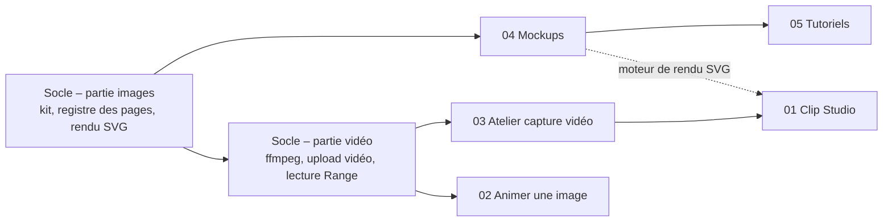

# Modules à pages – dossiers de conception

Ce dossier rassemble les dossiers de conception des prochains modules « à
pages » de ShareX Manager, c’est-à-dire des modules qui possèdent leur propre
espace de travail sous `/m/<module>/…`, à la manière d’AI Image Gen.

Chaque dossier est écrit comme si le module allait être développé : parcours,
interface, modèle de données, fonctions serveur, intégration avec la galerie,
performances, sécurité, découpage en étapes et critères d’acceptation. Clip
Studio est réalisé (modèles, assistant IA, voix, musique, sous-titres : voir
l’avancement dans son dossier) ; les autres le seront un par un.

## Sommaire

| Dossier | Objet | Dépend de |
| --- | --- | --- |
| [00 – Socle commun](00-socle-commun.md) | Ce que la plateforme doit offrir avant tout nouveau module : kit partagé, vidéo, `ffmpeg`, rendu SVG, pages publiques | – |
| [01 – Clip Studio](01-clip-studio.md) | Monter un clip court à partir d’images et de vidéos : timeline, transitions, titres, musique, export MP4 | Socle images, socle vidéo |
| [02 – Animer une image](02-animer-une-image.md) | Faire bouger une image avec un moteur vidéo IA (Veo, Sora, Kling…) | Socle vidéo, coffre de clés partagé |
| [03 – Atelier capture vidéo](03-atelier-capture-video.md) | Couper, recadrer, accélérer, sous-titrer et convertir les enregistrements d’écran | Socle vidéo |
| [04 – Mockups](04-mockups.md) | Poser une capture dans un cadre de navigateur, de téléphone ou sur un fond soigné | Socle images, rendu SVG |
| [05 – Tutoriels pas à pas](05-tutoriels-pas-a-pas.md) | Transformer une série de captures annotées en guide partageable | Socle images, rendu SVG, pages publiques |
| [06 – Scan Studio](06-scan-studio.md) | Traduire les pages d’un scan de manga : repérer le texte, le lire, le traduire, masquer l’original et relettrer, dans un atelier retouchable | Moteurs d’AI Image Gen et Codex CLI, facultatifs |

## Ordre de réalisation recommandé

L’ordre suit les dépendances techniques et la valeur livrée à chaque étape.
Les deux premiers modules ne touchent pas à la vidéo : ils servent à extraire
le kit commun d’AI Image Gen et à le valider sur de vrais besoins avant
d’ajouter la brique la plus lourde.

1. **Socle, partie images** : kit commun extrait d’AI Image Gen, registre des
   pages généré, moteur de rendu SVG côté serveur.
2. **04 Mockups** : premier consommateur du kit et du rendu SVG, sans vidéo.
3. **05 Tutoriels** : réutilise l’éditeur d’annotations et ajoute les pages
   publiques.
4. **Socle, partie vidéo** : `ffmpeg` dans l’image, upload et lecture des
   vidéos dans la galerie.
5. **03 Atelier capture vidéo** : le module vidéo le plus simple, qui éprouve
   `ffmpeg`, la file de rendu et le lecteur.
6. **01 Clip Studio** : le plus ambitieux, qui s’appuie sur tout ce qui
   précède.
7. **02 Animer une image** : peut être avancé dès que le socle vidéo existe,
   il dépend surtout des API externes.

## Principes communs à tous les modules

Ces règles valent pour chaque dossier ; elles ne sont pas répétées ensuite.

- **Code en anglais, textes en français.** Identifiants, fichiers et clés en
  anglais ; commentaires, interface et documentation en français, avec la
  typographie française.
- **Chargements localisés.** Un indicateur de chargement ne couvre que la
  zone réellement en attente. Pas de spinner pleine page au changement
  d’onglet ; les données déjà vues restent affichées pendant le
  rafraîchissement.
- **Animations `framer-motion`** sur tout ce qui vit : entrées et sorties de
  file d’attente, réordonnancement, apparition d’un rendu. Discrètes, rapides,
  et toujours sous `MotionConfig reducedMotion="user"`.
- **Menus contextuels partout où l’on manipule un objet**, avec le même
  contenu que le bouton « … » (voir le modèle `generation-menu.tsx` d’AI
  Image Gen).
- **Intégration à la galerie par `fileActions`.** Un module s’ouvre depuis le
  menu contextuel de la galerie avec la sélection ; il n’apparaît que s’il est
  activé et s’il accepte chaque fichier.
- **Toute écriture dans les uploads est annoncée** par
  `announceNewUpload(fileName)` (`lib/gallery-events.ts`), sinon le fichier
  n’apparaît qu’au rechargement de la galerie.
- **Données persistantes montées en volume.** Chaque module qui écrit dans
  `modules/<nom>/data` reçoit sa ligne dans `docker-compose.yml`
  (`./module-data/<nom>:/app/modules/<nom>/data`), sinon tout est perdu au
  prochain build.
- **Ressources du serveur.** La production (`ascencia-prod`) dispose de
  4 cœurs, 7,8 Gio de RAM et partage la machine avec MongoDB et Ascencia ID.
  Tout traitement lourd passe par une file avec une concurrence bornée.

## Hors périmètre

Ces dossiers ne traitent ni la facturation des API externes, ni un éventuel
mode multi-utilisateur avec quotas : ShareX Manager reste une instance
personnelle administrée par son propriétaire.
